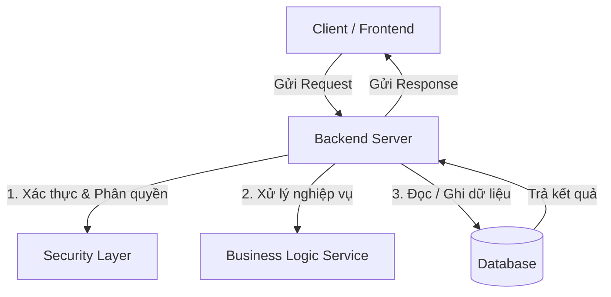

# Chapter 01: Backend là gì & Vai trò trong hệ thống

## 1. Mục tiêu bài học
- [ ] Hiểu được sự khác biệt giữa Frontend, Backend và Database.
- [ ] Nắm được 3 nhiệm vụ cốt lõi của Backend: Xử lý logic nghiệp vụ, Lưu trữ dữ liệu, Bảo mật.
- [ ] Trả lời được câu hỏi: *"Điều gì xảy ra khi bạn bấm nút 'Thanh toán' trên Shopee?"*

---

## 2. Lý thuyết cốt lõi

### 2.1 Backend là gì?
- **Frontend (Giao diện người dùng):** Những gì người dùng nhìn thấy và tương tác trực tiếp (HTML, CSS, JavaScript, React, Vue, Flutter, iOS/Android UI).
- **Backend (Phần ngầm - Server Side):** Bộ não xử lý đằng sau, chạy trên máy chủ (Server), tiếp nhận yêu cầu, tính toán, kiểm tra quyền hạn và thao tác với Database.
- **Database (Cơ sở dữ liệu):** Nơi lưu trữ dữ liệu bền vững (MySQL, PostgreSQL, MongoDB,...).

### 2.2 Ba trụ cột chính của Backend

1. **Business Logic (Nghiệp vụ):** Ví dụ: Tính toán mã giảm giá, kiểm tra số lượng hàng trong kho, trừ tiền trong ví.
2. **Data Persistence (Lưu trữ dữ liệu):** Lưu đơn hàng, thông tin tài khoản an toàn vào CSDL.
3. **Security & Authorization (Bảo mật):** Đảm bảo user chỉ xem được dữ liệu của chính mình, chống giả mạo token/request.

---

## 3. Ví dụ thực tế: Luồng mua hàng
1. Người dùng bấm **"Đặt hàng"** trên Web/App (Frontend).
2. Frontend gửi một **HTTP POST Request** kèm thông tin giỏ hàng đến **Backend Server**.
3. Backend Server thực hiện:
   - Kiểm tra Token xem người dùng đã đăng nhập chưa.
   - Truy vấn Database xem sản phẩm còn hàng không.
   - Tính toán tổng tiền (kèm phí ship, voucher).
   - Gọi cổng thanh toán (VNPAY/Momo/Stripe).
   - Lưu đơn hàng mới vào Database và gửi email thông báo.
4. Backend trả về **HTTP 200 OK** kèm mã đơn hàng cho Frontend hiển thị.

---

## 4. Câu hỏi phỏng vấn trọng tâm
1. **Tại sao không thể để toàn bộ logic xử lý và tính tiền ở Frontend?**
   - *Trả lời:* Frontend chạy trên máy người dùng, người dùng có thể can thiệp sửa đổi code JavaScript/Network để thay đổi giá trị tiền hoặc bypass kiểm tra. Mọi logic quan trọng và bảo mật bắt buộc phải kiểm tra ở Backend.
2. **Stateless Backend nghĩa là gì?**
   - *Trả lời:* Mỗi request từ Client gửi lên Server phải chứa đầy đủ thông tin để Server hiểu và xử lý, Server không lưu trạng thái phiên làm việc của Client trong bộ nhớ riêng của từng máy.

---

## 5. Bài tập tự luận & Thực hành
- [ ] Viết lại bằng sơ đồ hoặc lời giải thích: Luồng hoạt động khi bạn đăng nhập tài khoản Facebook/Google từ lúc nhập mật khẩu đến khi vào Newsfeed.
