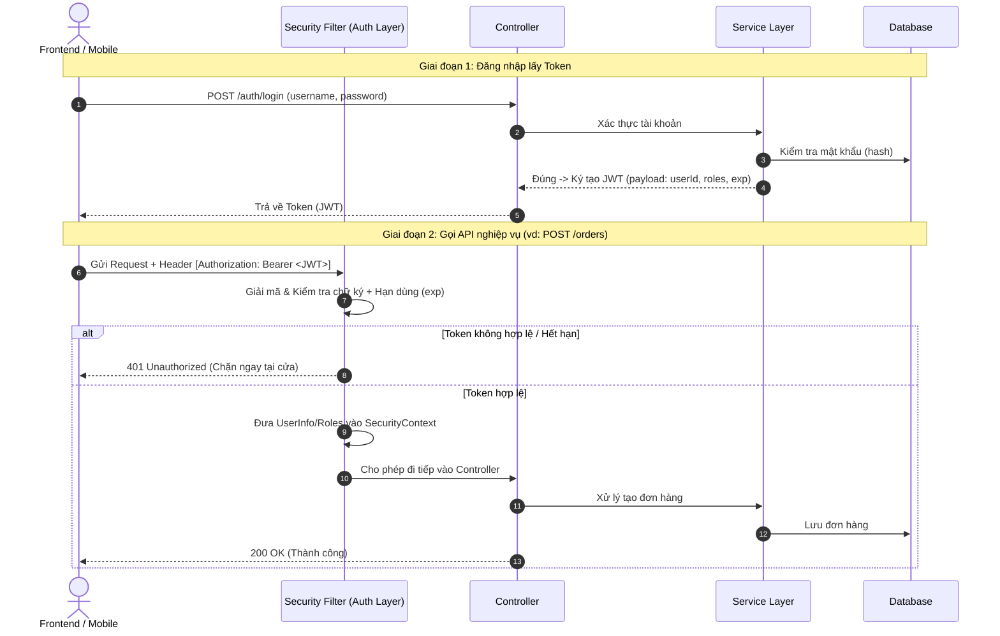

# Chapter 01: Backend là gì? & Vai trò trong hệ thống

## 1. Khái niệm cơ bản
- **Backend** (hay Server‑Side) là phần xử lý *logic nghiệp vụ*, *quản lý dữ liệu* và *cung cấp API* cho Frontend (Client).
- Nhiệm vụ chính:
  1. Nhận yêu cầu (Request) từ Client.
  2. Xác thực/Phân quyền (Security).
  3. Thực thi nghiệp vụ (Business Logic).
  4. Tương tác với Database (CRUD).
  5. Trả kết quả (Response) về Client.

## 2. Các thành phần cốt lõi của một Backend

Để một hệ thống Backend vận hành hoàn chỉnh, nó được cấu thành từ 4 thành phần trụ cột sau:

```┌──────────────────────────────┐
│ Client: Web / Mobile         │
└──────────────┬───────────────┘
               │
               │ 1. HTTP Request
               ▼
┌──────────────────────────────┐
│ Web / App Server             │
│ Tomcat, Nginx                │
└──────────────┬───────────────┘
               │
               │ 2. Đi qua các tầng lọc
               ▼
┌──────────────────────────────────────────────┐
│ Middleware – "Người gác cổng"                │
│                                              │
│  ┌────────────────────────────────────────┐  │
│  │ Auth Filter                            │  │
│  │ → Kiểm tra Token                       │  │
│  └────────────────────────────────────────┘  │
│                                              │
│  ┌────────────────────────────────────────┐  │
│  │ Rate Limiter                           │  │
│  │ → Chống Spam / giới hạn Request        │  │
│  └────────────────────────────────────────┘  │
│                                              │
│  ┌────────────────────────────────────────┐  │
│  │ CORS & Logger                          │  │
│  │ → Kiểm tra CORS + Ghi log              │  │
│  └────────────────────────────────────────┘  │
└──────────────────────┬───────────────────────┘
                       │
                       │ 3. Hợp lệ → Chuyển tiếp
                       ▼
┌──────────────────────────────────────┐
│ Application Core                     │
│ Controller + Service                  │
│                                      │
│ → Xử lý nghiệp vụ                    │
└──────────────────┬───────────────────┘
                   │
                   │ 4. Đọc / Ghi dữ liệu
                   ▼
        ┌─────────────────────────┐
        │ Database                │
        │ MySQL / Redis / ...     │
        └────────────┬────────────┘
                     │
                     │ 5. Trả kết quả
                     ▼
┌──────────────────────────────────────┐
│ Application Core                     │
│ Controller + Service                  │
└──────────────────┬───────────────────┘
                   │
                   │ 6. Đóng gói JSON
                   ▼
┌──────────────────────────────┐
│ Web / App Server             │
│ Tomcat, Nginx                │
└──────────────┬───────────────┘
               │
               │ 7. HTTP Response
               ▼
┌──────────────────────────────┐
│ Client: Web / Mobile         │
└──────────────────────────────┘
```

```
Client
  │
  │ HTTP Request
  ▼
Web/App Server
  │
  ▼
Middleware
  ├── Auth Filter      → Xác thực
  ├── Rate Limiter     → Giới hạn request
  └── CORS & Logger    → CORS + Ghi log
  │
  │ Request hợp lệ
  ▼
Controller
  │
  ▼
Service
  │
  │ Đọc/Ghi
  ▼
Database
  │
  │ Kết quả
  ▼
Service
  │
  ▼
Controller
  │
  │ JSON Response
  ▼
Web/App Server
  │
  │ HTTP Response
  ▼
Client
```
- **Client → Server → Middleware → Controller → Service → Database → Service → Controller → Server → Client**
---

### 2.1. Server (Web Server & Application Server)
- **Bản chất:** Là một máy tính (phần cứng) chạy các phần mềm chuyên dụng (phần mềm máy chủ) luôn luôn hoạt động 24/7 để lắng nghe các kết nối từ Internet qua các cổng mạng (Port như `80` cho HTTP, `443` cho HTTPS, `8080` cho development).
- **Phân loại trong thực tế:**
  - **Web Server (ví dụ: Nginx, Apache):** Đứng ở lớp ngoài cùng, chuyên phục vụ các file tĩnh (HTML, CSS, ảnh), điều hướng lưu lượng (Reverse Proxy), cân bằng tải (Load Balancer) và mã hóa SSL/TLS.
  - **Application Server (ví dụ: Embedded Tomcat trong Spring Boot, Node.js runtime):** Chạy mã nguồn ứng dụng, quản lý vòng đời ứng dụng, cấp phát luồng (Thread) để thực thi logic Backend.

---

### 2.2. API (Application Programming Interface)
- **Bản chất:** Là "bản hợp đồng" giao tiếp chuẩn hóa giữa Frontend và Backend. Nếu Frontend là khách hàng và Backend là nhà bếp, thì API chính là **Menu món ăn**.
- **Đặc điểm:**
  - Định nghĩa rõ: Đường dẫn (Endpoint/URL), Phương thức gửi (HTTP Method: `GET`, `POST`, `PUT`, `DELETE`), Dữ liệu gửi đi (Request Payload) và Dữ liệu trả về (Response).
  - Chuẩn định dạng trao đổi phổ biến nhất hiện nay: **JSON (JavaScript Object Notation)** vì nhẹ, dễ đọc và đa ngôn ngữ đều hỗ trợ.

---

### 2.3. Middleware ("Người gác cổng" - The Gatekeeper)
- **Bản chất:** Là các đoạn mã hoặc tầng trung gian nằm **giữa** lúc Server vừa nhận được HTTP Request và **trước khi** Request đó được chuyển tới phần xử lý nghiệp vụ chính (Controller/Service).
- **Tại sao Middleware được gọi là "Người gác cổng"?**
  Bởi vì bất kỳ yêu cầu nào từ bên ngoài muốn vào được "ngôi nhà" (Logic nghiệp vụ & Database) đều phải đi qua sự kiểm tra nghiêm ngặt của các Middleware:
  1. **Authentication & Authorization (Soát vé):** Kiểm tra xem người dùng đã đăng nhập chưa (Token hợp lệ không?) và có quyền thực hiện hành động này không (ví dụ: User thường không được gọi API của Admin).
  2. **Rate Limiting & Throttling (Chống giẫm đạp / Chống DDoS):** Giới hạn số lượng request từ 1 địa chỉ IP (ví dụ: tối đa 60 request/phút). Nếu gửi quá nhiều sẽ bị chặn ngay (`429 Too Many Requests`).
  3. **CORS (Cross-Origin Resource Sharing - Kiểm tra hộ chiếu):** Kiểm soát xem trang web từ tên miền khác có được phép truy cập tài nguyên của API này hay không.
  4. **Logging & Monitoring (Camera an ninh):** Ghi chép lại lịch sử truy cập: IP nào, gọi URL nào, lúc mấy giờ, tốn bao nhiêu mili-giây để sau này điều tra sự cố.
  5. **Global Exception Handling (Đội cấp cứu):** Bắt toàn bộ các lỗi bất ngờ (Exception) xảy ra trong hệ thống, chuyển đổi thành định dạng lỗi JSON lịch sự gửi về cho Client, ngăn không cho hệ thống văng lỗi lộ thông tin nhạy cảm.

---

### 2.4. Database (Hệ cơ sở dữ liệu)
- **Bản chất:** Nơi lưu trữ dữ liệu lâu dài và bền vững (Persistent Storage). Khi server tắt hoặc khởi động lại, dữ liệu trong Database vẫn nguyên vẹn.
- **Phân loại chính:**
  - **Cơ sở dữ liệu quan hệ (RDBMS / SQL - ví dụ: MySQL, PostgreSQL):** Dữ liệu được tổ chức chặt chẽ thành các bảng (Table), có khóa chính, khóa ngoại, đảm bảo tính toàn vẹn tuyệt đối theo chuẩn **ACID** (rất quan trọng cho giao dịch tiền tệ, đặt hàng).
  - **Cơ sở dữ liệu phi quan hệ (NoSQL - ví dụ: MongoDB):** Dữ liệu dạng tài liệu (Document/JSON), linh hoạt thay đổi cấu trúc, phù hợp với dữ liệu lớn, tốc độ ghi cao (bình luận, tin nhắn, bài viết mạng xã hội).
  - **Bộ nhớ đệm (In-Memory Cache - ví dụ: Redis):** Lưu trữ tạm thời dữ liệu thường xuyên truy cập trên RAM để phản hồi cực nhanh (chỉ mất 1 - 2 ms), giúp giảm tải tới 80% cho Database chính.

## 3. Ví dụ thực tế – Luồng mua hàng
1. Người dùng nhấn **"Đặt hàng"** trên Frontend.
2. Frontend gửi **POST /orders** tới Backend.
3. Backend thực hiện:
   - Kiểm tra token (đã đăng nhập?).
   - Kiểm tra tồn kho trong DB.
   - Tính tổng tiền, áp dụng voucher, phí ship.
   - Gọi cổng thanh toán (VNPAY/Momo/Stripe).
   - Lưu đơn hàng, trả về **orderId** và trạng thái.

## 4. Điểm mạnh của Backend
- **Bảo mật**: Dữ liệu nhạy cảm luôn ở server, không để lộ trên client.
- **Quy mô**: Có thể mở rộng bằng cách tăng server, cache, load‑balancer.
- **Kiểm soát**: Business logic tập trung, dễ duy trì, dễ kiểm thử.

## 5. Câu hỏi phỏng vấn & Trả lời chi tiết

### 5.1. Backend và Frontend khác nhau như thế nào?

| Tiêu chí | Frontend (Client-side) | Backend (Server-side) |
| :--- | :--- | :--- |
| **Môi trường thực thi** | Chạy trên thiết bị người dùng (Trình duyệt web, ứng dụng di động). | Chạy trên máy chủ (Server, Cloud, Docker container). |
| **Nhiệm vụ chính** | Hiển thị giao diện (UI), tương tác người dùng (UX), thu thập thao tác và hiển thị dữ liệu nhận được từ API. | Xử lý logic nghiệp vụ (Business Logic), xác thực bảo mật, quản lý giao dịch và lưu trữ dữ liệu (Database). |
| **Bảo mật** | **Không an toàn**: Code tải về máy người dùng nên có thể bị can thiệp, soi mã nguồn hoặc sửa đổi. | **Bảo mật cao**: Code và dữ liệu nằm kín trên server; kiểm soát quyền truy cập, bảo vệ dữ liệu nhạy cảm (mật khẩu, thanh toán). |
| **Công nghệ tiêu biểu** | HTML, CSS, JavaScript/TypeScript, React, Vue, Angular, Flutter... | Java (Spring Boot), Node.js, Python, Go, C# (.NET), MySQL, PostgreSQL, Redis, Kafka... |

> **Tóm tắt:** Frontend là *"bộ mặt"* (những gì người dùng nhìn thấy và tương tác), còn Backend là *"bộ não"* và *"động cơ"* (nơi tính toán, xử lý bảo mật và lưu trữ dữ liệu âm thầm đằng sau).

---

### 5.2. Tại sao chúng ta phải có lớp Service (Business Logic) giữa Controller và Repository?

Mô hình chuẩn 3 lớp trong ứng dụng Backend (3-Tier Architecture):
$$\text{Client} \longrightarrow \text{Controller} \longrightarrow \text{Service} \longrightarrow \text{Repository} \longrightarrow \text{Database}$$

Việc tách riêng lớp **Service** tuân theo nguyên lý **Separation of Concerns (SoC)** và **Single Responsibility Principle (SRP)**:
1. **Phân định rõ trách nhiệm:**
   - **Controller:** Chỉ lo giao tiếp HTTP (nhận URL, validate định dạng request body/DTO, trả về mã HTTP status 200, 400, 404, 500).
   - **Service:** Chứa toàn bộ **quy tắc nghiệp vụ** (kiểm tra tồn kho, áp dụng voucher, tính thuế, kiểm tra quyền nâng cao, gọi cổng thanh toán bên thứ ba).
   - **Repository:** Chỉ tương tác dữ liệu với Database (CRUD, SQL/JPA queries).
2. **Khả năng tái sử dụng (Reusability):**
   - Cùng một hàm nghiệp vụ trong Service có thể được gọi từ nhiều nơi: REST Controller, GraphQL, Kafka Consumer hoặc Job chạy nền định kỳ (Cron Scheduler).
3. **Quản lý Transaction (`@Transactional`):**
   - Một nghiệp vụ thường tương tác với **nhiều Repository cùng lúc** (ví dụ khi đặt hàng: trừ tiền, trừ tồn kho, tạo đơn hàng). Service là nơi gom cụm các thao tác này vào một Transaction để đảm bảo tính toàn vẹn (rollback nếu có bước thất bại).
4. **Dễ viết Unit Test:**
   - Kiểm thử logic nghiệp vụ độc lập mà chỉ cần Mock Repository, không cần khởi chạy môi trường HTTP/Web Server.

---

### 5.3. JWT được sử dụng ở đâu trong luồng trên?



- **Vị trí trong kiến trúc:** JWT nằm ở **Security Filter / Interceptor** (tầng bảo mật ngay cổng vào của Backend, trước khi request chạm tới `Controller`).
- Nếu Token không hợp lệ hoặc hết hạn, request bị chặn ngay lập tức (`401 Unauthorized`), giúp bảo vệ Controller, Service và Database khỏi việc phải tốn tài nguyên xử lý request rác.

---

### 5.4. Khi nào nên dùng Synchronous vs Asynchronous request?

#### **A. Synchronous (Đồng bộ - Blocking):**
- **Cơ chế:** Client gửi request và **chờ đợi** Server xử lý xong mới nhận kết quả để tiếp tục bước sau.
- **Khi nào nên dùng:**
  - Cần dữ liệu ngay tức thì để hiển thị cho người dùng: Đăng nhập, lấy thông tin cá nhân, kiểm tra số dư ví, xem chi tiết sản phẩm.
  - Tác vụ xử lý nhanh (dưới vài trăm mili-giây).
  - Nghiệp vụ có các bước phụ thuộc chặt chẽ vào kết quả của bước liền trước.

#### **B. Asynchronous (Bất đồng bộ - Non-blocking / Background Processing):**
- **Cơ chế:** Client gửi yêu cầu, Server tiếp nhận ngay (trả về mã `202 Accepted` hoặc Task/Job ID) rồi đẩy việc vào hàng đợi (Queue như RabbitMQ, Kafka, hoặc Thread Pool ngầm) để xử lý sau.
- **Khi nào nên dùng:**
  - **Tác vụ tốn nhiều thời gian:** Xuất/nhập file Excel lớn hàng trăm ngàn dòng, render/encode video, tạo báo cáo PDF nặng, gửi email thông báo hoặc SMS OTP.
  - **Giảm tải hệ thống khi có lưu lượng tăng vọt (Peak Traffic):** Xếp hàng xử lý giao dịch flash-sale, đặt vé xem phim để tránh làm sập Database.
  - **Tác vụ gọi dịch vụ bên thứ ba:** Bắn webhook, ghi log phân tích tracking hành vi người dùng.

---
*Hướng dẫn thực hành:* Đọc lại toàn bộ các bước trên, vẽ sơ đồ luồng trên giấy để nắm vững kiến thức nền tảng.
