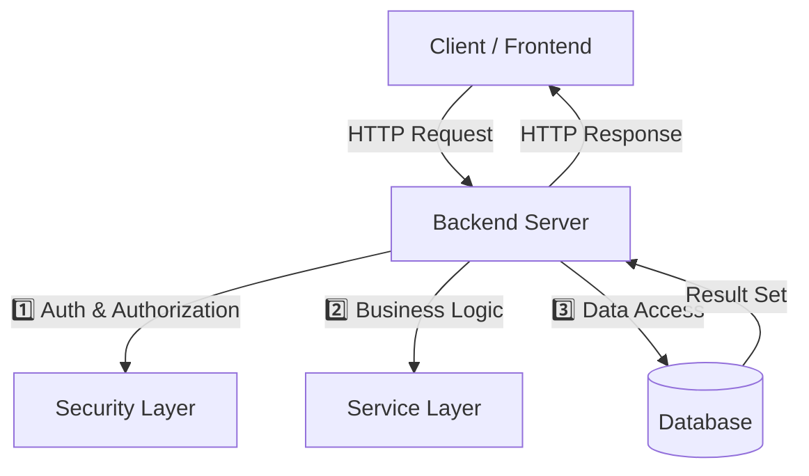

# Chapter 01: Backend là gì? & Vai trò trong hệ thống

## 1. Khái niệm cơ bản
- **Backend** (hay Server‑Side) là phần xử lý *logic nghiệp vụ*, *quản lý dữ liệu* và *cung cấp API* cho Frontend (Client).
- Nhiệm vụ chính:
  1. Nhận yêu cầu (Request) từ Client.
  2. Xác thực/Phân quyền (Security).
  3. Thực thi nghiệp vụ (Business Logic).
  4. Tương tác với Database (CRUD).
  5. Trả kết quả (Response) về Client.

## 2. Thành phần chính của một Backend

- **Security Layer**: Kiểm tra token, quyền hạn.
- **Service Layer**: Áp dụng quy tắc nghiệp vụ (giảm giá, kiểm kê, tính thuế…).
- **Database**: Lưu trữ bền vững, giao dịch ACID.

## 3. Ví dụ thực tế – Luồng mua hàng
1. Người dùng nhấn **"Đặt hàng"** trên Frontend.
2. Frontend gửi **POST /orders** tới Backend.
3. Backend thực hiện:
   - Kiểm tra token (đã đăng nhập?).
   - Kiểm tra tồn kho trong DB.
   - Tính tổng tiền, áp dụng voucher, phí ship.
   - Gọi cổng thanh toán (VNPAY/Momo/Stripe).
   - Lưu đơn hàng, trả về **orderId** và trạng thái.

## 4. Điểm mạnh của Backend
- **Bảo mật**: Dữ liệu nhạy cảm luôn ở server, không để lộ trên client.
- **Quy mô**: Có thể mở rộng bằng cách tăng server, cache, load‑balancer.
- **Kiểm soát**: Business logic tập trung, dễ duy trì, dễ kiểm thử.

## 5. Câu hỏi phỏng vấn thường gặp
- Backend và Frontend khác nhau như thế nào?
- Tại sao chúng ta phải có lớp Service (Business Logic) giữa Controller và Repository?
- JWT được sử dụng ở đâu trong luồng trên?
- Khi nào nên dùng **synchronous** vs **asynchronous** request?

---
*Hướng dẫn thực hành:* Đọc lại toàn bộ các bước trên, vẽ sơ đồ luồng trên giấy, và trả lời các câu hỏi ở mục 5.
