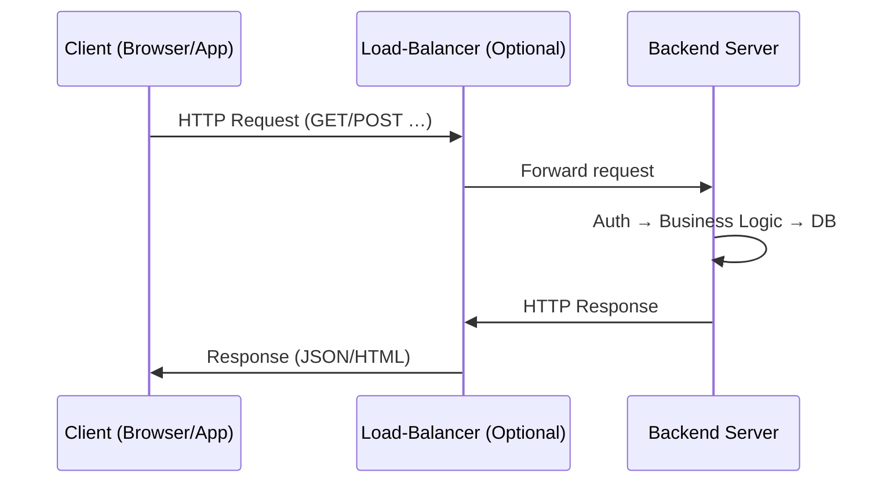

# Chapter 02: Kiến trúc Client‑Server & Vòng đời Request‑Response

## 1. Khái niệm
- **Client‑Server** là mô hình 2 lớp cơ bản: **Client** (frontend, trình duyệt, app) gửi **request** tới **Server** (backend) và nhận **response**.
- Server chịu trách nhiệm **xử lý nghiệp vụ**, **truy cập dữ liệu**, **bảo mật** và **trả kết quả**.

## 2. Thành phần chính

- **Load Balancer** (Nginx, HAProxy) – phân phối tải tới nhiều server.
- **Web Server** – nhận request, trả file tĩnh, chuyển tiếp tới **App Server**.
- **App Server** – thực thi logic, gọi **Service Layer** → **Repository/DAO** → **Database**.

## 3. Vòng đời Request‑Response (HTTP)
1. **Browser** mở kết nối TCP tới **IP & Port** của server (thường 80/443).
2. **TCP 3‑way handshake** thiết lập kết nối.
3. **Client** gửi **HTTP Request** (method, URL, headers, body).
4. **Server** nhận, **đọc** header, **kiểm tra** token/authorization.
5. **Controller** định tuyến tới **Service**, thực hiện nghiệp vụ.
6. **Service** gọi **Repository** để thao tác DB, trả về **DTO**.
7. **Controller** đóng gói **HTTP Response** (status, headers, body).
8. **Client** nhận và **render** (HTML/JSON).

## 4. Ví dụ thực tế – GET danh sách sản phẩm
```http
GET /api/v1/products?page=1&size=20 HTTP/1.1
Host: api.example.com
Authorization: Bearer <jwt-token>
Accept: application/json
```
- **Server** xác thực token, gọi `ProductService.getProducts(page,size)`, truy vấn DB, trả về JSON:
```json
{
  "status": 200,
  "data": [{"id":1,"name":"Sản phẩm A","price":100000}],
  "page":1,
  "size":20,
  "totalElements":124
}
```

## 5. Điểm mạnh / Cân nhắc
- **Scalability**: Thêm máy server, load‑balancer để chịu tải.
- **Statelessness**: HTTP request nên không lưu trạng thái server, giúp scale.
- **Latency**: Mỗi hop (LB → Server) tăng độ trễ, cần cân bằng giữa độ an toàn và tốc độ.

## 6. Câu hỏi phỏng vấn thường gặp
- Client‑Server khác gì so với **Peer‑to‑Peer**?
- Giải thích **TCP 3‑way handshake** và tại sao HTTP/HTTPS dựa trên TCP?
- Khi nào nên dùng **HTTP/2** thay vì HTTP/1.1?
- Làm sao để **keep‑alive** giảm số lần thiết lập kết nối?
- Đưa ra giải pháp **load‑balancing** cho một dịch vụ có 10 000 req/s.

---
*Thực hành:* Vẽ lại sơ đồ trên giấy, chạy lệnh `curl -I https://api.example.com/health` để kiểm tra header response.
