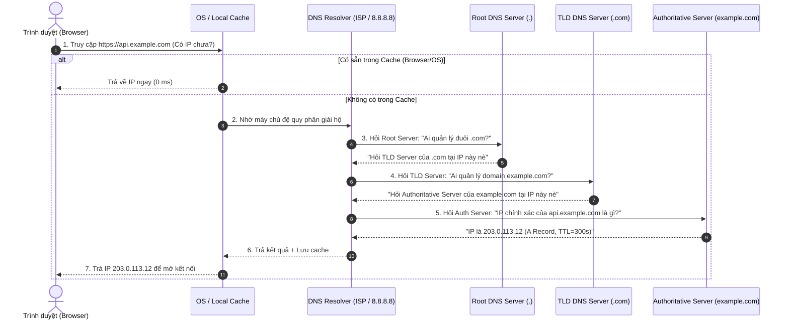

# Chapter 03: Networking, IP, Port & DNS

## 1. Địa chỉ IP & Port
- **IP (Internet Protocol) address** là địa chỉ duy nhất cho mỗi thiết bị trên mạng.
  - IPv4: 32‑bit, dạng `192.168.0.1` (≈ 4,3 tỷ địa chỉ).
  - IPv6: 128‑bit, dạng `2001:0db8:85a3:0000:0000:8a2e:0370:7334` (không còn lo hết địa chỉ).
- **Port** là số hiệu 0‑65535 dùng để phân biệt các dịch vụ trên cùng một IP.
  - Port 80 → HTTP, 443 → HTTPS, 3306 → MySQL, 5432 → PostgreSQL, 8080 → Tomcat/Spring Boot.
- Khi client muốn gọi API, nó sẽ **kết nối tới `IP:Port`** của server.

## 2. TCP vs UDP
| Thuộc tính | TCP | UDP |
|------------|-----|-----|
| Kết nối | Three‑way handshake (đảm bảo giao tiếp ổn định) | Không kết nối, gửi gói độc lập |
| Độ tin cậy | Đảm bảo thứ tự, retransmission nếu mất gói | Không bảo guarantee, tốc độ cao |
| Ứng dụng | Web (HTTP/HTTPS), email, file transfer | Streaming video, VoIP, DNS query |

## 3. DNS (Domain Name System) – "Cuốn danh bạ Internet"
- **Bản chất:** Con người dễ nhớ tên chữ (`google.com`, `shopee.vn`), nhưng máy tính chỉ hiểu địa chỉ số IP (`142.250.190.46`). DNS đóng vai trò như **cuốn danh bạ điện thoại**, tra cứu từ "Tên người" sang "Số điện thoại".
- **Quy trình phân giải DNS (DNS Resolution Flow):**



- **Các Record DNS phổ biến:**
  - `A (Address)`: Ánh xạ tên miền -> Địa chỉ **IPv4** (ví dụ: `api.example.com -> 203.0.113.12`).
  - `AAAA`: Ánh xạ tên miền -> Địa chỉ **IPv6**.
  - `CNAME (Canonical Name)`: Tên miền bí danh trỏ tới một tên miền khác (ví dụ: `www.example.com -> example.com`).
  - `MX (Mail Exchange)`: Chỉ định máy chủ nhận email của tên miền.
  - `TXT`: Lưu trữ văn bản tự do, dùng để xác thực quyền sở hữu tên miền, cấu hình bảo mật email chống giả mạo (SPF, DKIM).
- **TTL (Time-To-Live):** Thời gian (tính bằng giây) mà các máy chủ trung gian được phép lưu cache bản ghi DNS. Ví dụ `TTL = 300` (5 phút). Sau thời gian này, cache hết hạn và máy chủ sẽ phải hỏi lại Authoritative server.

---

## 4. Công cụ kiểm tra mạng qua CLI (Thực hành Ngày 05 & 06)
```bash
# 1. ping: Kiểm tra xem máy chủ đích có online không và đo độ trễ (latency RTT)
ping google.com

# 2. nslookup: Tra cứu địa chỉ IP và máy chủ DNS đang giải quyết tên miền
nslookup google.com

# 3. traceroute (Windows dùng: tracert): Theo dõi đường đi qua bao nhiêu trạm router (hops) để đến đích
tracert 8.8.8.8

# 4. curl -I: Kiểm tra kết nối HTTP/HTTPS, Header phản hồi và Status Code
curl -I https://google.com
```

---

## 5. Ví dụ thực tế – Gọi API Backend
```http
GET /api/v1/products HTTP/1.1
Host: api.example.com   # DNS giải thành IP (203.0.113.12)
Port: 443               # HTTPS, kết nối TCP an toàn SSL/TLS
```
- **Ý nghĩa Port trong đời thực:**
  - Hãy tưởng tượng địa chỉ IP giống như **Địa chỉ của một tòa nhà chung cư**.
  - Số Port chính là **Số phòng căn hộ** bên trong tòa nhà đó:
    - Phòng `80` / `443`: Tiếp khách Web (HTTP/HTTPS).
    - Phòng `3306`: Quản lý kho hàng Database (MySQL).
    - Phòng `8080`: Xưởng chế tạo Java (Tomcat / Spring Boot).
  - Nhờ có Port, một máy chủ duy nhất có thể chạy song song hàng chục dịch vụ khác nhau mà không hề bị xung đột hay nhầm lẫn gói tin.

---

## 6. Câu hỏi phỏng vấn & Trả lời chi tiết

### 6.1. IPv4 và IPv6 khác nhau như thế nào? Lợi ích của IPv6?
- **Khác biệt:**
  - **IPv4:** Độ dài 32-bit (dạng 4 nhóm số thập phân, vd: `192.168.1.1`), cung cấp tối đa khoảng $2^{32} \approx 4,3$ tỷ địa chỉ. Hiện nay địa chỉ IPv4 toàn cầu đã cạn kiệt, buộc phải dùng kỹ thuật NAT (Network Address Translation) để chia sẻ chung IP công cộng.
  - **IPv6:** Độ dài 128-bit (dạng 8 nhóm số thập lục phân, vd: `2001:0db8:85a3::7334`), cung cấp tới $2^{128} \approx 3,4 \times 10^{38}$ địa chỉ (đủ để gán cho mỗi hạt cát trên trái đất một địa chỉ IP).
- **Lợi ích IPv6:** Không lo cạn kiệt địa chỉ, loại bỏ hoàn toàn sự phức tạp của NAT, tích hợp sẵn giao thức mã hóa bảo mật IPSec ở tầng mạng và định tuyến gói tin nhanh hơn.

### 6.2. Khi một API chậm, làm sao kiểm tra vấn đề do DNS, Network Latency hay Server Processing?
Sử dụng công cụ `curl` với các tham số đo thời gian chuyên sâu (`curl -w`):
```bash
curl -o /dev/null -s -w 'DNS: %{time_namelookup}s | Connect TCP: %{time_connect}s | TLS: %{time_appconnect}s | First Byte (Server): %{time_starttransfer}s | Total: %{time_total}s\n' https://api.example.com/health
```
- Nếu `time_namelookup` lớn (> 200ms) $\rightarrow$ **Nghẽn do DNS Resolution** (cần đổi DNS Server hoặc tăng TTL).
- Nếu `time_connect` hoặc `time_appconnect` lớn $\rightarrow$ **Nghẽn do Mạng (Network Latency/Khoảng cách địa lý)**.
- Nếu `time_starttransfer` (thời gian từ lúc gửi xong request đến khi nhận byte đầu tiên - TTFB) lớn $\rightarrow$ **Server Processing chậm** (Backend code query DB chậm, thiếu Index hoặc nghẽn CPU/RAM).

### 6.3. Giải thích TCP 3-way handshake chi tiết (SYN, SYN-ACK, ACK)
- **Bước 1 (SYN):** Client sinh ngẫu nhiên số thứ tự $ISN_C = X$ và gửi gói tin cờ `SYN = 1` tới Server để yêu cầu mở kết nối. Trạng thái Client chuyển thành `SYN_SENT`.
- **Bước 2 (SYN-ACK):** Server nhận được, đồng ý kết nối. Server sinh số thứ tự $ISN_S = Y$, gửi lại gói tin có cờ `SYN = 1` và `ACK = X + 1` (xác nhận đã nhận được $X$). Trạng thái Server thành `SYN_RCVD`.
- **Bước 3 (ACK):** Client nhận được SYN-ACK, gửi lại gói tin xác nhận `ACK = Y + 1`. Trạng thái cả hai chuyển sang `ESTABLISHED`. Lúc này kết nối tin cậy 2 chiều hoàn tất và dữ liệu HTTP bắt đầu truyền tải.

### 6.4. Tại sao DNS Caching quan trọng? TTL ảnh hưởng thế nào đến thay đổi IP?
- **Tầm quan trọng:** Tra cứu DNS qua nhiều cấp server tốn từ 50ms - vài trăm mili-giây. Caching tại Trình duyệt, OS và ISP giúp trả về IP ngay lập tức (0ms), giảm tải cho toàn bộ hệ thống DNS trên Internet.
- **Ảnh hưởng của TTL khi đổi IP:**
  - Nếu đặt **TTL quá lớn** (ví dụ 1 ngày = 86400s): Khi bạn chuyển server sang IP mới, người dùng vẫn tiếp tục trỏ về IP cũ trong suốt 24 giờ do cache chưa hết hạn (dẫn tới gián đoạn dịch vụ).
  - **Kinh nghiệm thực tế (DevOps):** Trước khi chuyển đổi IP máy chủ 2 ngày, hạ TTL xuống thấp (ví dụ: `300` giây - 5 phút). Khi chuyển IP xong và hệ thống chạy ổn định, nâng TTL lên lại (ví dụ: `3600` giây) để tận dụng cache.

### 6.5. Khi muốn load-balance các service, bạn có thể dùng DNS Round-Robin? Nhược điểm?
- **DNS Round-Robin là gì:** Cấu hình 1 domain trỏ tới nhiều A-Record (nhiều IP máy chủ). DNS Server sẽ xoay vòng danh sách IP trả về cho mỗi client khác nhau để san sẻ tải.
- **Nhược điểm chí mạng:**
  1. **Không biết tình trạng máy chủ (No Health Check):** Nếu 1 trong các server bị sập (die), DNS vẫn vô tư phát IP đó cho người dùng, khiến người dùng gặp lỗi trắng trang hoặc không thể kết nối.
  2. **Vấn đề do Cache (TTL):** Trình duyệt hoặc nhà mạng ISP lưu cache IP đó hàng chục phút, khiến lưu lượng không thể phân bổ đều và không thể ngắt người dùng khỏi server gặp sự cố ngay lập tức.
- **Khuyến nghị:** DNS Round-Robin chỉ nên dùng cho tầng phân phối vùng địa lý (GeoDNS). Để cân bằng tải thực tế cho Backend, nên dùng Load Balancer chuyên dụng (Nginx, HAProxy, AWS ALB) có cơ chế Health Check tự động loại bỏ server lỗi.

---
*Thực hành Ngày 05 & 06:*
1. Mở Terminal gõ `nslookup google.com` để xem các IP và kiểm tra thời gian phản hồi.
2. Thử gõ `ping 127.0.0.1` (IP Loopback localhost) để kiểm tra card mạng máy tính nội bộ của bạn.
