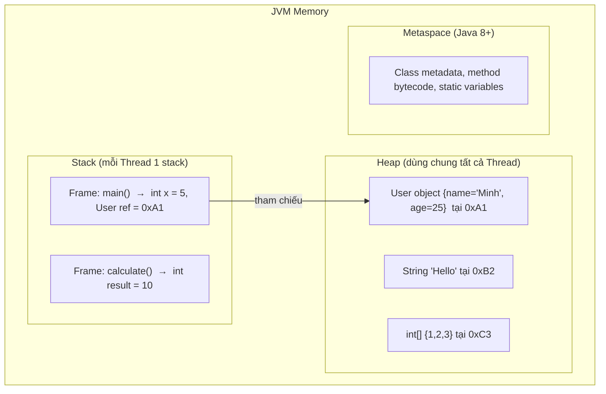
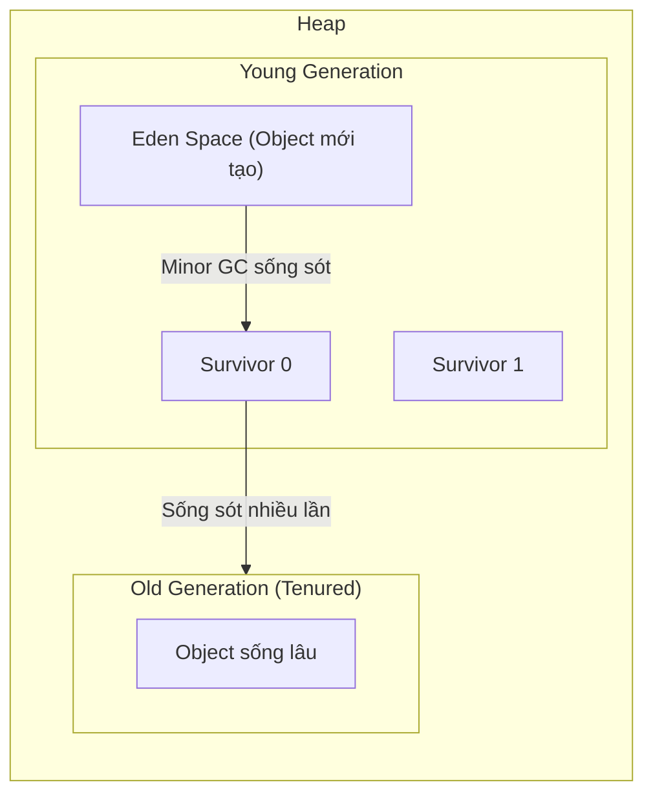

# Chapter 03: Quản lý Bộ nhớ Java – Stack vs Heap & Garbage Collection

## 1. Tổng quan kiến trúc bộ nhớ JVM



## 2. Stack Memory

### 2.1 Đặc điểm
- Mỗi **Thread** có 1 Stack riêng.
- Lưu trữ theo cơ chế **LIFO** (Last In, First Out).
- Mỗi khi gọi 1 method → tạo 1 **Stack Frame** mới, khi method kết thúc → frame bị xoá.
- Lưu gì?
  - **Biến cục bộ** kiểu primitive (`int`, `double`, `boolean`…)
  - **Tham chiếu** (reference / địa chỉ) trỏ tới đối tượng trên Heap.
  - **Thông tin method** (return address, parameters).
- **Nhanh** (truy xuất tuần tự), **kích thước giới hạn** (~512KB – 1MB mặc định).
- Lỗi: `StackOverflowError` khi đệ quy quá sâu (quá nhiều frame).

### 2.2 Ví dụ minh hoạ
```java
public class Demo {
    public static void main(String[] args) {
        int x = 10;                  // x lưu trên Stack
        User user = new User("An");  // user (reference) trên Stack, object trên Heap
        int result = add(x, 20);     // Tạo Stack Frame mới cho add()
        System.out.println(result);
    }

    static int add(int a, int b) {  // a, b lưu trên Stack Frame của add()
        int sum = a + b;            // sum lưu trên Stack Frame của add()
        return sum;                 // Frame add() bị xoá khi return
    }
}
```

**Trạng thái Stack khi đang chạy `add()`:**
```
┌─────────────────────────┐
│ Frame: add()            │  ← Đỉnh stack (đang chạy)
│   a = 10, b = 20       │
│   sum = 30              │
├─────────────────────────┤
│ Frame: main()           │
│   x = 10                │
│   user = 0xA1 (ref)     │
│   result = ? (chưa gán) │
└─────────────────────────┘
```

## 3. Heap Memory

### 3.1 Đặc điểm
- Dùng **chung** cho tất cả Thread.
- Lưu gì?
  - **Tất cả đối tượng** tạo bởi từ khoá `new` (Object, Array, String…).
  - **Biến instance** (thuộc tính) của đối tượng.
- **Kích thước lớn**, có thể cấu hình bằng `-Xms` (initial) và `-Xmx` (max).
- Lỗi: `OutOfMemoryError: Java heap space` khi Heap đầy.

### 3.2 Cấu trúc Heap (Generational)


| Vùng | Chứa gì | GC |
|------|---------|-----|
| **Eden** | Object mới tạo (`new`) | Minor GC (nhanh, thường xuyên) |
| **Survivor** (S0, S1) | Object sống sót qua Minor GC | Minor GC |
| **Old Gen** (Tenured) | Object tồn tại lâu (qua nhiều lần GC) | Major / Full GC (chậm, hiếm) |

## 4. Pass-by-Value trong Java

### 4.1 Quy tắc vàng
> **Java luôn luôn là Pass-by-Value**, KHÔNG BAO GIỜ có Pass-by-Reference.

- Với **primitive**: copy **giá trị** → hàm không thể thay đổi biến gốc.
- Với **reference type**: copy **địa chỉ (reference)** → hàm có thể thay đổi **thuộc tính** của object gốc, nhưng **không thể** thay đổi biến reference gốc trỏ sang object khác.

### 4.2 Ví dụ với Primitive
```java
public static void main(String[] args) {
    int x = 10;
    changeValue(x);
    System.out.println(x);  // 10 ← Không đổi!
}

static void changeValue(int num) {
    num = 999;  // Chỉ thay đổi bản copy, không ảnh hưởng x
}
```

### 4.3 Ví dụ với Reference Type
```java
public static void main(String[] args) {
    User user = new User("An");
    changeName(user);
    System.out.println(user.getName());  // "Bình" ← Thay đổi được thuộc tính!

    replaceUser(user);
    System.out.println(user.getName());  // "Bình" ← Không đổi! (vẫn trỏ object cũ)
}

// Thay đổi thuộc tính → CÓ ảnh hưởng object gốc
static void changeName(User u) {
    u.setName("Bình");   // u và user cùng trỏ tới 1 object → đổi được
}

// Gán lại reference → KHÔNG ảnh hưởng biến gốc
static void replaceUser(User u) {
    u = new User("Cường");  // u trỏ sang object MỚI, user vẫn trỏ object cũ
}
```

### 4.4 Giải thích bằng sơ đồ
```
Trước changeName():
  main: user ──→ [User: name="An"]    ← Heap
  changeName: u ──→ (cùng object)

Sau changeName():
  main: user ──→ [User: name="Bình"]  ← Object bị đổi thuộc tính
  
Trong replaceUser():
  main: user ──→ [User: name="Bình"]  ← Vẫn trỏ object cũ
  replaceUser: u ──→ [User: name="Cường"] ← Object MỚI (bị huỷ khi hàm kết thúc)
```

## 5. Garbage Collection (GC)

### 5.1 Khi nào Object thành "rác"?
Khi **không còn bất kỳ biến nào** tham chiếu tới nó.

```java
User a = new User("An");   // Object 1 được tạo, a trỏ tới
User b = a;                 // b cũng trỏ tới Object 1
a = new User("Bình");       // a trỏ sang Object 2, Object 1 vẫn có b trỏ tới
b = null;                   // Object 1 KHÔNG CÒN ai trỏ tới → trở thành RÁC
// GC sẽ tự động dọn Object 1 khi cần
```

### 5.2 Các loại GC trong JVM
| GC | Đặc điểm |
|----|----------|
| **Serial GC** | Đơn thread, phù hợp app nhỏ |
| **Parallel GC** | Đa thread, mặc định Java 8 |
| **G1 GC** | Mặc định Java 9+, cân bằng throughput & latency |
| **ZGC / Shenandoah** | Ultra-low latency (< 10ms pause), Java 15+ |

### 5.3 Các lỗi bộ nhớ phổ biến
| Lỗi | Nguyên nhân | Cách phòng tránh |
|-----|------------|-----------------|
| `StackOverflowError` | Đệ quy vô hạn / quá sâu | Kiểm tra base case, dùng iteration |
| `OutOfMemoryError: Java heap space` | Tạo quá nhiều object, memory leak | Tăng `-Xmx`, kiểm tra leak |
| `OutOfMemoryError: Metaspace` | Load quá nhiều class (plugin) | Tăng `-XX:MaxMetaspaceSize` |

### 5.4 Memory Leak trong Java
Dù có GC, Java vẫn có thể bị **memory leak** khi:
- Lưu object vào **static collection** mà không bao giờ xoá.
- Listener/callback đăng ký mà không huỷ (unregister).
- Thread pool giữ reference quá lâu.

```java
// ❌ Memory leak: List tĩnh cứ add mãi, GC không thu hồi được
static List<byte[]> cache = new ArrayList<>();

void processData() {
    byte[] data = new byte[1024 * 1024]; // 1MB
    cache.add(data);  // data sẽ KHÔNG BAO GIỜ bị GC vì cache là static
}
```

## 6. Câu hỏi phỏng vấn thường gặp
1. Phân biệt **Stack** và **Heap** trong Java? Mỗi vùng lưu gì?
2. Java là **Pass-by-Value** hay **Pass-by-Reference**? Giải thích với ví dụ.
3. Tại sao truyền object vào hàm có thể thay đổi thuộc tính nhưng không thể thay đổi reference gốc?
4. Garbage Collection hoạt động thế nào? Khi nào 1 object bị thu hồi?
5. **Minor GC** và **Major GC** khác nhau thế nào? Cái nào ảnh hưởng performance hơn?
6. `StackOverflowError` và `OutOfMemoryError` khác nhau thế nào?
7. Giải thích **Memory Leak** trong Java có thể xảy ra dù đã có GC.

---
*Thực hành:* Vẽ sơ đồ bộ nhớ Stack/Heap cho 1 đoạn code có gọi hàm, viết code chứng minh Pass-by-Value với int và Object.
