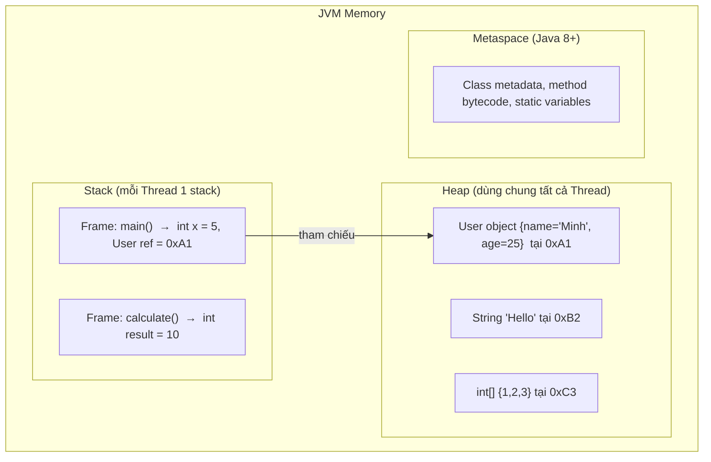
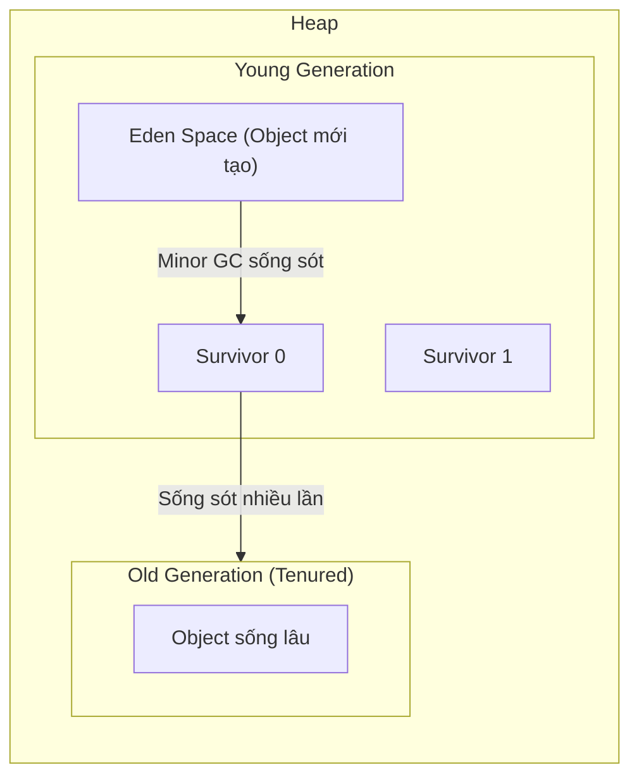

# Chapter 03: Quản lý Bộ nhớ Java – Stack vs Heap & Garbage Collection

## 1. Tổng quan kiến trúc bộ nhớ JVM



## 2. Stack Memory

### 2.1 Đặc điểm
- Mỗi **Thread** có 1 Stack riêng.
- Lưu trữ theo cơ chế **LIFO** (Last In, First Out).
- Mỗi khi gọi 1 method → tạo 1 **Stack Frame** mới, khi method kết thúc → frame bị xoá.
- Lưu gì?
  - **Biến cục bộ** kiểu primitive (`int`, `double`, `boolean`…)
  - **Tham chiếu** (reference / địa chỉ) trỏ tới đối tượng trên Heap.
  - **Thông tin method** (return address, parameters).
- **Nhanh** (truy xuất tuần tự), **kích thước giới hạn** (~512KB – 1MB mặc định).
- Lỗi: `StackOverflowError` khi đệ quy quá sâu (quá nhiều frame).

### 2.2 Ví dụ minh hoạ
```java
public class Demo {
    public static void main(String[] args) {
        int x = 10;                  // x lưu trên Stack
        User user = new User("An");  // user (reference) trên Stack, object trên Heap
        int result = add(x, 20);     // Tạo Stack Frame mới cho add()
        System.out.println(result);
    }

    static int add(int a, int b) {  // a, b lưu trên Stack Frame của add()
        int sum = a + b;            // sum lưu trên Stack Frame của add()
        return sum;                 // Frame add() bị xoá khi return
    }
}
```

**Trạng thái Stack khi đang chạy `add()`:**
```
┌─────────────────────────┐
│ Frame: add()            │  ← Đỉnh stack (đang chạy)
│   a = 10, b = 20       │
│   sum = 30              │
├─────────────────────────┤
│ Frame: main()           │
│   x = 10                │
│   user = 0xA1 (ref)     │
│   result = ? (chưa gán) │
└─────────────────────────┘
```

## 3. Heap Memory

### 3.1 Đặc điểm
- Dùng **chung** cho tất cả Thread.
- Lưu gì?
  - **Tất cả đối tượng** tạo bởi từ khoá `new` (Object, Array, String…).
  - **Biến instance** (thuộc tính) của đối tượng.
- **Kích thước lớn**, có thể cấu hình bằng `-Xms` (initial) và `-Xmx` (max).
- Lỗi: `OutOfMemoryError: Java heap space` khi Heap đầy.

### 3.2 Cấu trúc Heap (Generational)


| Vùng | Chứa gì | GC |
|------|---------|-----|
| **Eden** | Object mới tạo (`new`) | Minor GC (nhanh, thường xuyên) |
| **Survivor** (S0, S1) | Object sống sót qua Minor GC | Minor GC |
| **Old Gen** (Tenured) | Object tồn tại lâu (qua nhiều lần GC) | Major / Full GC (chậm, hiếm) |

## 4. Pass-by-Value trong Java

### 4.1 Quy tắc vàng
> **Java luôn luôn là Pass-by-Value**, KHÔNG BAO GIỜ có Pass-by-Reference.

- Với **primitive**: copy **giá trị** → hàm không thể thay đổi biến gốc.
- Với **reference type**: copy **địa chỉ (reference)** → hàm có thể thay đổi **thuộc tính** của object gốc, nhưng **không thể** thay đổi biến reference gốc trỏ sang object khác.

### 4.2 Ví dụ với Primitive
```java
public static void main(String[] args) {
    int x = 10;
    changeValue(x);
    System.out.println(x);  // 10 ← Không đổi!
}

static void changeValue(int num) {
    num = 999;  // Chỉ thay đổi bản copy, không ảnh hưởng x
}
```

### 4.3 Ví dụ với Reference Type
```java
public static void main(String[] args) {
    User user = new User("An");
    changeName(user);
    System.out.println(user.getName());  // "Bình" ← Thay đổi được thuộc tính!

    replaceUser(user);
    System.out.println(user.getName());  // "Bình" ← Không đổi! (vẫn trỏ object cũ)
}

// Thay đổi thuộc tính → CÓ ảnh hưởng object gốc
static void changeName(User u) {
    u.setName("Bình");   // u và user cùng trỏ tới 1 object → đổi được
}

// Gán lại reference → KHÔNG ảnh hưởng biến gốc
static void replaceUser(User u) {
    u = new User("Cường");  // u trỏ sang object MỚI, user vẫn trỏ object cũ
}
```

### 4.4 Giải thích bằng sơ đồ
```
Trước changeName():
  main: user ──→ [User: name="An"]    ← Heap
  changeName: u ──→ (cùng object)

Sau changeName():
  main: user ──→ [User: name="Bình"]  ← Object bị đổi thuộc tính
  
Trong replaceUser():
  main: user ──→ [User: name="Bình"]  ← Vẫn trỏ object cũ
  replaceUser: u ──→ [User: name="Cường"] ← Object MỚI (bị huỷ khi hàm kết thúc)
```

## 5. Garbage Collection (GC)

### 5.1 Khi nào Object thành "rác"?
Khi **không còn bất kỳ biến nào** tham chiếu tới nó.

```java
User a = new User("An");   // Object 1 được tạo, a trỏ tới
User b = a;                 // b cũng trỏ tới Object 1
a = new User("Bình");       // a trỏ sang Object 2, Object 1 vẫn có b trỏ tới
b = null;                   // Object 1 KHÔNG CÒN ai trỏ tới → trở thành RÁC
// GC sẽ tự động dọn Object 1 khi cần
```

### 5.2 Các loại GC trong JVM
| GC | Đặc điểm |
|----|----------|
| **Serial GC** | Đơn thread, phù hợp app nhỏ |
| **Parallel GC** | Đa thread, mặc định Java 8 |
| **G1 GC** | Mặc định Java 9+, cân bằng throughput & latency |
| **ZGC / Shenandoah** | Ultra-low latency (< 10ms pause), Java 15+ |

### 5.3 Các lỗi bộ nhớ phổ biến
| Lỗi | Nguyên nhân | Cách phòng tránh |
|-----|------------|-----------------|
| `StackOverflowError` | Đệ quy vô hạn / quá sâu | Kiểm tra base case, dùng iteration |
| `OutOfMemoryError: Java heap space` | Tạo quá nhiều object, memory leak | Tăng `-Xmx`, kiểm tra leak |
| `OutOfMemoryError: Metaspace` | Load quá nhiều class (plugin) | Tăng `-XX:MaxMetaspaceSize` |

### 5.4 Memory Leak trong Java
Dù có GC, Java vẫn có thể bị **memory leak** khi:
- Lưu object vào **static collection** mà không bao giờ xoá.
- Listener/callback đăng ký mà không huỷ (unregister).
- Thread pool giữ reference quá lâu.

```java
// ❌ Memory leak: List tĩnh cứ add mãi, GC không thu hồi được
static List<byte[]> cache = new ArrayList<>();

void processData() {
    byte[] data = new byte[1024 * 1024]; // 1MB
    cache.add(data);  // data sẽ KHÔNG BAO GIỜ bị GC vì cache là static
}
```

## 6. Câu hỏi phỏng vấn & Trả lời chi tiết

### 6.1. Phân biệt Stack và Heap trong Java? Mỗi vùng lưu gì?
| Tiêu chí | Vùng nhớ Stack | Vùng nhớ Heap |
| :--- | :--- | :--- |
| **Nội dung lưu trữ** | Biến cục bộ nguyên thuỷ (primitive), địa chỉ tham chiếu (reference address) và khung ngăn xếp hàm (Stack Frames). | Toàn bộ **Đối tượng (Object)** thực tế (`new Object()`), các phần tử mảng, chuỗi String. |
| **Phạm vi truy cập** | Thuộc về từng Thread riêng biệt (Thread-safe, không chia sẻ giữa các thread). | Dùng chung cho toàn bộ ứng dụng (Shared Memory, các thread đều có thể truy cập). |
| **Thời gian tồn tại** | Rất ngắn: Tự động giải phóng ngay khi hàm kết thúc thực thi. | Lâu dài: Được quản lý và thu gom bởi tiến trình dọn rác ngầm **Garbage Collector (GC)**. |
| **Tốc độ truy xuất** | Cực kỳ nhanh (cơ chế LIFO - Last In First Out). | Chậm hơn Stack do cấp phát động và quản lý phân mảnh. |
| **Lỗi tràn bộ nhớ** | `java.lang.StackOverflowError` (khi đệ quy vô hạn). | `java.lang.OutOfMemoryError: Java heap space` (khi tạo quá nhiều object mà GC không dọn kịp). |

### 6.2. Java là Pass-by-Value hay Pass-by-Reference? Giải thích với ví dụ
- **Khẳng định 100%:** Java **CHỈ DUY NHẤT LÀ PASS-BY-VALUE** (Truyền theo giá trị). Không có bất kỳ ngoại lệ nào!
- **Giải thích:**
  - Khi truyền biến kiểu Primitive: Java copy **giá trị số** sang hàm mới.
  - Khi truyền biến kiểu Object Reference: Java copy **giá trị của địa chỉ ô nhớ (Memory Address)** sang hàm mới (chứ không phải truyền bản thân biến tham chiếu ban đầu).
  - *Ví dụ chứng minh:*
    ```java
    public static void swap(Person p1, Person p2) {
        Person temp = p1;
        p1 = p2;
        p2 = temp;
        // p1 và p2 ở đây chỉ là bản sao địa chỉ cục bộ, hoán đổi không làm ảnh hưởng gì tới biến gốc ở ngoài!
    }
    ```
    Sau khi gọi hàm `swap(a, b)`, `a` và `b` ở ngoài vẫn giữ nguyên vị trí cũ.

### 6.3. Tại sao truyền object vào hàm có thể thay đổi thuộc tính nhưng không thể thay đổi reference gốc?
- Vì hàm nhận vào một **bản sao của địa chỉ tham chiếu**.
- Cả biến gốc ở ngoài và biến tham số trong hàm đều đang cầm 2 bản sao chìa khóa mở vào **cùng một ngôi nhà (cùng một object trên Heap)**:
  - Khi gọi `p.setName("An")`: Ta dùng chìa khóa để vào trong nhà sơn lại tường $\rightarrow$ Thuộc tính object trên Heap bị thay đổi thật.
  - Khi gọi `p = new Person("Bình")`: Biến tham số cục bộ vứt chìa khóa cũ đi để cầm chìa khóa căn nhà mới $\rightarrow$ Tham chiếu gốc bên ngoài vẫn đang trỏ tới căn nhà ban đầu, hoàn toàn không bị ảnh hưởng.

### 6.4. Garbage Collection (GC) hoạt động thế nào? Khi nào 1 object bị thu hồi?
- **Thuật toán tiếp cận GC Roots (Reachability Analysis):** JVM bắt đầu rà soát từ các rễ GC (`GC Roots` gồm: biến cục bộ trên Stack, luồng đang chạy `Active Threads`, biến `static`).
- **Điều kiện thu hồi:** Một object trên Heap sẽ trở thành "Rác" (Eligible for GC) khi nó **không còn bất kỳ đường dẫn tham chiếu nào (Unreachable)** kết nối từ GC Roots tới nó.
- **Quy trình dọn:** GC thực hiện theo nguyên lý **Mark and Sweep** (Đánh dấu các object còn sống $\rightarrow$ Quét dọn các object rác $\rightarrow$ Dồn dịch bộ nhớ Compact để chống phân mảnh).

### 6.5. Minor GC và Major GC khác nhau thế nào? Cái nào ảnh hưởng performance hơn?
- **Bộ nhớ Heap chia thành các thế hệ (Generational Heap):**
  - **Young Generation (Eden + Survivor S0, S1):** Nơi các object mới sinh ra. Đa số object trong Java chết trẻ (chỉ sống trong một hàm rồi hết giá trị).
  - **Old Generation (Tenured):** Chứa các object sống sót qua nhiều chu kỳ dọn rác (Long-lived objects như Spring Beans, Connection Pools, Caches).
- **So sánh:**
  - **Minor GC:** Dọn rác ở vùng **Young Generation**. Diễn ra rất thường xuyên, tốc độ cực nhanh (vài mili-giây), ít ảnh hưởng hệ thống.
  - **Major GC (hay Full GC):** Dọn rác ở toàn bộ vùng nhớ (đặc biệt là **Old Generation**). Khi chạy Full GC, toàn bộ ứng dụng có thể bị dừng tạm thời (**Stop-The-World - STW**). Nếu Full GC diễn ra liên tục, hệ thống sẽ bị giật lag, tăng độ trễ (latency spike) nghiêm trọng.

### 6.6. `StackOverflowError` và `OutOfMemoryError` khác nhau thế nào?
- **`StackOverflowError`:** Xảy ra ở vùng nhớ **Stack**. Thường do hàm đệ quy không có điểm dừng hoặc gọi lồng nhau quá sâu làm đầy dung lượng ngăn xếp của Thread (mặc định ~1MB).
- **`OutOfMemoryError (OOM)`:** Xảy ra ở vùng nhớ **Heap**. Xảy ra khi ứng dụng liên tục tạo thêm đối tượng mới trên Heap mà dung lượng Heap đã chạm trần (`-Xmx`), đồng thời Garbage Collector đã cố gắng chạy hết sức nhưng không thể giải phóng đủ chỗ trống.

### 6.7. Giải thích Memory Leak trong Java có thể xảy ra dù đã có GC
- Trong Java, Memory Leak không phải là "thất lạc con trỏ" như C/C++, mà là tình trạng: **Một đối tượng KHÔNG CÒN ĐƯỢC ỨNG DỤNG SỬ DỤNG NỮA nhưng VẪN BỊ THAM CHIẾU (Referenced) bởi một object sống khác**, khiến GC không thể dọn dẹp nó.
- **Các nguyên nhân gây Memory Leak điển hình trong Backend:**
  1. **Dùng biến `static` giữ collection:** `public static List<User> cache = new ArrayList<>()` cứ nhét thêm vào mà không bao giờ xóa. Vì `static` sống trọn vòng đời của JVM, list này sẽ giữ chặt các object mãi mãi.
  2. **Không đóng tài nguyên (Unclosed Resources):** Quên đóng kết nối Database (`Connection`), `InputStream`, `Socket`.
  3. **Lắng nghe sự kiện (Event Listeners / Observers):** Đăng ký Listener nhưng quên unregister khi đối tượng bị hủy.
  4. **Dùng `ThreadLocal` không gọi `.remove()`:** Trong môi trường Thread Pool (như Tomcat), thread được tái sử dụng. Dữ liệu trong `ThreadLocal` nếu không dọn sẽ tích tụ dần làm tràn bộ nhớ.

---
*Thực hành:* Vẽ sơ đồ bộ nhớ Stack/Heap cho 1 đoạn code có gọi hàm, viết code chứng minh Pass-by-Value với int và Object.
