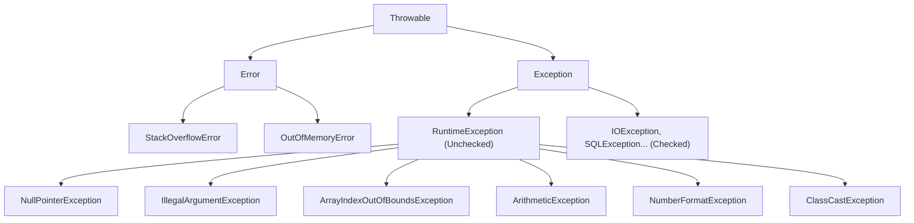
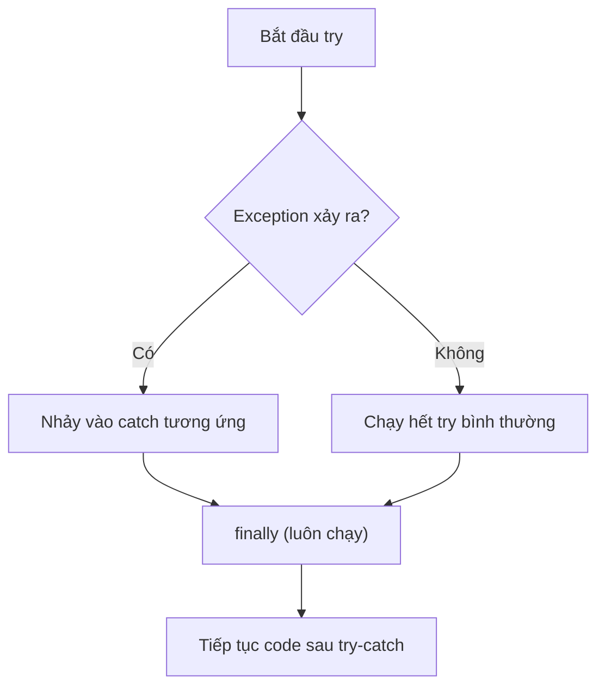

# Chapter 05: Xử lý Ngoại lệ (Exception Handling)

## 1. Exception là gì?
- **Exception** (Ngoại lệ) là sự kiện bất thường xảy ra trong quá trình chạy chương trình, làm gián đoạn luồng thực thi bình thường.
- Nếu không xử lý, chương trình sẽ **crash** và in ra stack trace.

```java
int[] arr = {1, 2, 3};
System.out.println(arr[5]);  // ❌ ArrayIndexOutOfBoundsException → Chương trình crash!
```

## 2. Hệ thống phân cấp Exception trong Java



### 2.1 Error (Lỗi hệ thống)
- **Không nên bắt / xử lý** vì quá nghiêm trọng (JVM gặp vấn đề).
- Ví dụ: `StackOverflowError`, `OutOfMemoryError`.

### 2.2 Checked Exception (Ngoại lệ kiểm tra)
- **Bắt buộc phải xử lý** tại compile‑time (dùng `try-catch` hoặc `throws`).
- Compiler sẽ báo lỗi nếu bạn không xử lý.
- Ví dụ: `IOException`, `SQLException`, `FileNotFoundException`, `ClassNotFoundException`.

```java
// ❌ Compile Error nếu không xử lý IOException
FileReader file = new FileReader("data.txt");  // FileNotFoundException (checked)
```

### 2.3 Unchecked Exception (Ngoại lệ không kiểm tra)
- Kế thừa từ `RuntimeException`.
- **Không bắt buộc** phải xử lý tại compile‑time (nhưng nên bắt nếu có thể).
- Thường do **lỗi logic của lập trình viên**.
- Ví dụ: `NullPointerException`, `ArrayIndexOutOfBoundsException`, `ArithmeticException`, `IllegalArgumentException`.

```java
String s = null;
s.length();          // ❌ NullPointerException (unchecked, runtime crash)

int result = 10 / 0; // ❌ ArithmeticException (unchecked)
```

### 2.4 Bảng so sánh

| Tiêu chí | Checked Exception | Unchecked Exception |
|----------|-------------------|---------------------|
| Kế thừa từ | `Exception` (trực tiếp) | `RuntimeException` |
| Bắt buộc xử lý? | ✅ Có (compile-time) | ❌ Không |
| Nguyên nhân | Yếu tố bên ngoài (file, network, DB) | Lỗi logic code |
| Ví dụ | `IOException`, `SQLException` | `NullPointerException`, `ArithmeticException` |

## 3. Cú pháp try – catch – finally

### 3.1 Cấu trúc cơ bản
```java
try {
    // Code có thể gây exception
    int result = 10 / 0;
    System.out.println(result);       // Dòng này KHÔNG chạy
} catch (ArithmeticException e) {
    // Xử lý khi bắt được exception
    System.out.println("Lỗi: " + e.getMessage());  // "Lỗi: / by zero"
} finally {
    // LUÔN LUÔN chạy, dù có exception hay không
    System.out.println("Khối finally luôn chạy");
}
System.out.println("Chương trình tiếp tục chạy bình thường");
```

### 3.2 Luồng thực thi



### 3.3 Bắt nhiều Exception
```java
try {
    String s = null;
    s.length();         // NullPointerException
} catch (NullPointerException e) {
    System.out.println("Lỗi null: " + e.getMessage());
} catch (ArithmeticException e) {
    System.out.println("Lỗi số học: " + e.getMessage());
} catch (Exception e) {
    // Catch chung (đặt cuối cùng, vì Exception là cha của tất cả)
    System.out.println("Lỗi khác: " + e.getMessage());
}

// Hoặc gộp nhiều exception trong 1 catch (Java 7+):
try {
    // ...
} catch (NullPointerException | ArithmeticException e) {
    System.out.println("Lỗi: " + e.getMessage());
}
```

> ⚠️ **Thứ tự catch:** Từ Exception **cụ thể** → **tổng quát** (con trước, cha sau).

## 4. throw & throws

### 4.1 `throw` – Quăng exception ra
```java
public void setAge(int age) {
    if (age < 0 || age > 150) {
        throw new IllegalArgumentException("Tuổi không hợp lệ: " + age);
    }
    this.age = age;
}
```

### 4.2 `throws` – Khai báo method có thể quăng exception
```java
// Khai báo: method này CÓ THỂ quăng IOException (checked)
// Người gọi method PHẢI xử lý (try-catch hoặc throws tiếp)
public String readFile(String path) throws IOException {
    BufferedReader reader = new BufferedReader(new FileReader(path));
    return reader.readLine();
}
```

### 4.3 So sánh throw vs throws

| | `throw` | `throws` |
|---|---------|---------|
| Vị trí | Trong **thân** method | Tại **khai báo** method |
| Mục đích | **Quăng** 1 exception cụ thể | **Khai báo** method có thể quăng exception |
| Số lượng | 1 exception mỗi lần | Nhiều exception (phẩy phân cách) |
| Ví dụ | `throw new RuntimeException("msg");` | `void read() throws IOException, SQLException` |

## 5. Custom Exception (Ngoại lệ tự tạo)

### 5.1 Tại sao cần Custom Exception?
- Exception có sẵn quá chung chung, không mô tả đúng lỗi nghiệp vụ.
- Custom Exception giúp code **rõ ràng hơn** và dễ xử lý theo từng loại lỗi.

### 5.2 Tạo Unchecked Custom Exception (phổ biến nhất)
```java
// Kế thừa RuntimeException → KHÔNG bắt buộc try-catch
public class ResourceNotFoundException extends RuntimeException {

    public ResourceNotFoundException(String message) {
        super(message);
    }

    public ResourceNotFoundException(String resourceName, Long id) {
        super(resourceName + " không tìm thấy với ID: " + id);
    }
}

// Sử dụng:
public User getUserById(Long id) {
    return userRepository.findById(id)
        .orElseThrow(() -> new ResourceNotFoundException("User", id));
    // Quăng: "User không tìm thấy với ID: 5"
}
```

### 5.3 Tạo Checked Custom Exception (ít dùng hơn)
```java
// Kế thừa Exception → BẮT BUỘC try-catch
public class InsufficientBalanceException extends Exception {

    private final double currentBalance;
    private final double withdrawAmount;

    public InsufficientBalanceException(double currentBalance, double withdrawAmount) {
        super("Số dư không đủ. Hiện có: " + currentBalance + ", cần rút: " + withdrawAmount);
        this.currentBalance = currentBalance;
        this.withdrawAmount = withdrawAmount;
    }
    
    // Getter nếu cần
}
```

## 6. Try-with-Resources (Java 7+)

### 6.1 Vấn đề: Quên đóng tài nguyên
```java
// ❌ Phải đóng resource trong finally (code dài dòng, dễ quên)
BufferedReader reader = null;
try {
    reader = new BufferedReader(new FileReader("data.txt"));
    String line = reader.readLine();
} catch (IOException e) {
    e.printStackTrace();
} finally {
    if (reader != null) {
        try { reader.close(); } catch (IOException e) { e.printStackTrace(); }
    }
}
```

### 6.2 Giải pháp: try-with-resources
```java
// ✅ Tự động đóng resource khi kết thúc try (gọn, an toàn)
try (BufferedReader reader = new BufferedReader(new FileReader("data.txt"))) {
    String line = reader.readLine();
    System.out.println(line);
} catch (IOException e) {
    e.printStackTrace();
}
// reader.close() được gọi TỰ ĐỘNG khi ra khỏi try, dù có exception hay không
```

### 6.3 Điều kiện sử dụng
- Resource phải implement interface `AutoCloseable` (hoặc `Closeable`).
- Có thể khai báo **nhiều resource** cách nhau bằng `;`:

```java
try (
    FileInputStream fis = new FileInputStream("input.txt");
    FileOutputStream fos = new FileOutputStream("output.txt")
) {
    // Đọc input, ghi output
} catch (IOException e) {
    e.printStackTrace();
}
// Cả fis và fos đều tự động đóng
```

## 7. Best Practices xử lý Exception

| ✅ Nên | ❌ Không nên |
|--------|-------------|
| Bắt exception **cụ thể** (`NullPointerException`) | Bắt `Exception` chung chung |
| Ghi log đầy đủ (`logger.error("msg", e)`) | Bắt rồi **nuốt** (catch trống rỗng) |
| Dùng **Custom Exception** cho lỗi nghiệp vụ | Dùng `RuntimeException("msg")` chung chung |
| Dùng `try-with-resources` cho I/O | Tự `close()` trong finally |
| Quăng sớm, bắt muộn (Throw early, Catch late) | Bắt exception ở mọi nơi |

```java
// ❌ Anti-pattern: Nuốt exception (swallowing)
try {
    riskyOperation();
} catch (Exception e) {
    // Không làm gì cả → bug ẩn, rất khó debug!
}

// ✅ Best practice: Log hoặc throw lại
try {
    riskyOperation();
} catch (SpecificException e) {
    logger.error("Lỗi khi xử lý: {}", e.getMessage(), e);
    throw new BusinessException("Xử lý thất bại", e);
}
```

## 8. Câu hỏi phỏng vấn thường gặp
1. Phân biệt **Checked** và **Unchecked** Exception? Cho ví dụ mỗi loại.
2. Phân biệt `Error` và `Exception`?
3. Khối `finally` có **luôn luôn** chạy không? (Gợi ý: `System.exit()` thì sao?)
4. `throw` và `throws` khác nhau thế nào?
5. Tại sao nên tạo **Custom Exception** thay vì dùng `RuntimeException` trực tiếp?
6. **Try-with-resources** hoạt động thế nào? Điều kiện để resource được tự đóng?
7. Thứ tự `catch` có quan trọng không? Nếu để `catch (Exception e)` trước `catch (IOException e)` thì sao?
8. Giải thích nguyên tắc **"Throw early, Catch late"**.

---
*Thực hành:* Viết code bắt `ArithmeticException` và `ArrayIndexOutOfBoundsException`, tạo `ResourceNotFoundException` kế thừa `RuntimeException`, thử `try-with-resources` đọc file.
