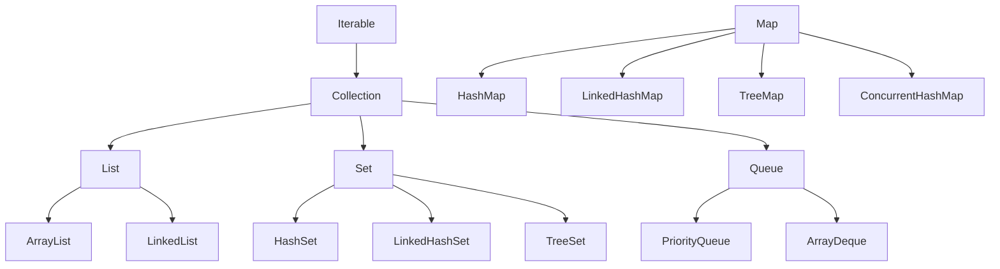

# Chapter 04: Java Collections Framework – List, Set, Map, Queue

## 1. Tổng quan Collections Framework


## 2. List Interface – Danh sách có thứ tự, cho phép trùng

### ArrayList (Dùng nhiều nhất)
- Cơ chế: **mảng động** (dynamic array), tự mở rộng khi đầy.
- `get(i)` → **O(1)** (truy xuất nhanh). `add/remove` ở giữa → **O(n)** (phải dịch phần tử).

```java
List<String> names = new ArrayList<>();
names.add("An");
names.add("Bình");
names.add("An");         // Cho phép trùng
names.get(0);            // "An" – O(1)
names.remove(1);         // Xoá "Bình" – O(n)
names.contains("An");    // true
names.size();            // 2
```

### LinkedList
- Cơ chế: **danh sách liên kết đôi** (doubly linked list).
- `add/remove` ở đầu/cuối → **O(1)**. `get(i)` → **O(n)** (phải duyệt).

| Thao tác | ArrayList | LinkedList |
|----------|-----------|------------|
| `get(i)` | **O(1)** ✅ | O(n) |
| `add(cuối)` | O(1)* | **O(1)** ✅ |
| `add/remove(giữa)` | O(n) | **O(1)** nếu có node ✅ |
| Bộ nhớ | Ít hơn | Nhiều hơn (lưu thêm pointer) |

> 💡 **Quy tắc:** 90% dùng `ArrayList`. Chỉ dùng `LinkedList` khi thêm/xóa ở đầu rất nhiều.

## 3. Set Interface – Không trùng lặp

### HashSet
- **Không thứ tự**, không trùng. Kiểm tra trùng qua `hashCode()` + `equals()`.
- `add`, `remove`, `contains` → **O(1)**.

### LinkedHashSet
- Giữ **thứ tự chèn**. Performance tương tự HashSet.

### TreeSet
- **Tự động sắp xếp** (natural ordering hoặc Comparator). Cài đặt bằng Red-Black Tree.
- `add`, `remove`, `contains` → **O(log n)**.

```java
Set<String> hashSet = new HashSet<>(List.of("Bình", "An", "Cường", "An"));
// [Cường, An, Bình] – không thứ tự, bỏ trùng "An"

Set<String> linkedSet = new LinkedHashSet<>(List.of("Bình", "An", "Cường"));
// [Bình, An, Cường] – giữ thứ tự chèn

Set<String> treeSet = new TreeSet<>(List.of("Bình", "An", "Cường"));
// [An, Bình, Cường] – sắp xếp alphabet
```

### hashCode() & equals()
```java
// Set kiểm tra trùng bằng: hashCode() → equals()
// Nếu override equals() thì PHẢI override hashCode()
public class Product {
    private Long id;
    @Override
    public boolean equals(Object o) {
        if (this == o) return true;
        if (!(o instanceof Product p)) return false;
        return Objects.equals(id, p.id);
    }
    @Override
    public int hashCode() { return Objects.hash(id); }
}
```

## 4. Map Interface – Cặp Key-Value

### HashMap (Dùng nhiều nhất)
- Key **không trùng**, Value có thể trùng. Key cho phép 1 `null`.
- Cơ chế: Mảng Bucket → Hash Function → xử lý va chạm (LinkedList → Red-Black Tree khi > 8 node).
- `get`, `put`, `containsKey` → **O(1)** trung bình.

```java
Map<String, Integer> scores = new HashMap<>();
scores.put("An", 90);
scores.put("Bình", 85);
scores.put("An", 95);           // Key trùng → GHI ĐÈ value → An=95
scores.get("An");               // 95
scores.getOrDefault("Cường", 0);// 0 (key không tồn tại)
scores.containsKey("Bình");     // true
scores.size();                  // 2

// Duyệt Map
for (Map.Entry<String, Integer> entry : scores.entrySet()) {
    System.out.println(entry.getKey() + ": " + entry.getValue());
}
```

### So sánh các Map
| | HashMap | LinkedHashMap | TreeMap | ConcurrentHashMap |
|---|---------|-------------|---------|-------------------|
| Thứ tự | Không | Thứ tự chèn | Sắp xếp theo key | Không |
| Null key | 1 null | 1 null | ❌ Không | ❌ Không |
| Thread-safe | ❌ | ❌ | ❌ | ✅ |
| Performance | O(1) | O(1) | O(log n) | O(1) |

## 5. Queue & Deque

```java
// PriorityQueue: phần tử nhỏ nhất luôn ở đầu (Min-Heap)
Queue<Integer> pq = new PriorityQueue<>();
pq.offer(30); pq.offer(10); pq.offer(20);
pq.poll();  // 10 (nhỏ nhất)

// ArrayDeque: Stack + Queue linh hoạt
Deque<String> deque = new ArrayDeque<>();
deque.push("A");   // Stack: addFirst
deque.push("B");
deque.pop();        // "B" (LIFO)
```

## 6. Câu hỏi phỏng vấn
1. ArrayList vs LinkedList: khi nào dùng cái nào?
2. HashMap hoạt động bên dưới như thế nào? (Bucket, hashCode, collision)
3. Tại sao override `equals()` thì phải override `hashCode()`?
4. HashSet vs TreeSet vs LinkedHashSet?
5. ConcurrentHashMap khác HashMap thế nào?

---
*Thực hành:* Dùng ArrayList, HashSet, HashMap thao tác CRUD. Test trùng lặp trong Set. Duyệt Map bằng entrySet().
