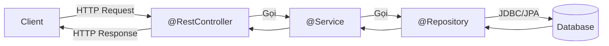

# Chapter 03: Kiến trúc 3 tầng Spring MVC – Controller, Service, Repository

## 1. Kiến trúc 3 tầng


| Tầng | Annotation | Nhiệm vụ |
|------|-----------|---------|
| **Controller** | `@RestController` | Nhận request, validate input, trả response |
| **Service** | `@Service` | Business logic, transaction |
| **Repository** | `@Repository` | Truy cập database |

## 2. @RestController
```java
@RestController
@RequestMapping("/api/v1/users")
public class UserController {
    private final UserService userService;
    public UserController(UserService userService) { this.userService = userService; }

    @GetMapping
    public ResponseEntity<List<UserResponse>> getAllUsers() {
        return ResponseEntity.ok(userService.getAllUsers());
    }

    @GetMapping("/{id}")
    public ResponseEntity<UserResponse> getUserById(@PathVariable Long id) {
        return ResponseEntity.ok(userService.getUserById(id));
    }

    @PostMapping
    public ResponseEntity<UserResponse> createUser(@Valid @RequestBody UserRequest request) {
        return ResponseEntity.status(HttpStatus.CREATED).body(userService.createUser(request));
    }

    @PutMapping("/{id}")
    public ResponseEntity<UserResponse> updateUser(@PathVariable Long id, @Valid @RequestBody UserRequest request) {
        return ResponseEntity.ok(userService.updateUser(id, request));
    }

    @DeleteMapping("/{id}")
    public ResponseEntity<Void> deleteUser(@PathVariable Long id) {
        userService.deleteUser(id);
        return ResponseEntity.noContent().build();
    }
}
```

## 3. Nhận dữ liệu đầu vào
| Annotation | Nguồn | Ví dụ |
|-----------|-------|-------|
| `@PathVariable` | URL path `/users/{id}` | `@PathVariable Long id` |
| `@RequestParam` | Query string `?name=An` | `@RequestParam(required = false) String name` |
| `@RequestBody` | JSON body (POST/PUT) | `@RequestBody UserRequest request` |
| `@RequestHeader` | HTTP header | `@RequestHeader("Authorization") String token` |

## 4. ResponseEntity\<T\>
```java
// Tuỳ biến status code, headers, body
return ResponseEntity.ok(data);                           // 200
return ResponseEntity.status(HttpStatus.CREATED).body(d); // 201
return ResponseEntity.noContent().build();                // 204
return ResponseEntity.notFound().build();                 // 404
return ResponseEntity.badRequest().body(errors);          // 400
```

## 5. Tổ chức Package chuẩn
```
com.example.app/
├── controller/         UserController.java
├── service/            UserService.java (interface)
│   └── impl/           UserServiceImpl.java
├── repository/         UserRepository.java
├── model/entity/       UserEntity.java
├── model/dto/          UserRequest.java, UserResponse.java
├── exception/          ResourceNotFoundException.java, GlobalExceptionHandler.java
└── config/             AppConfig.java
```

## 6. Câu hỏi phỏng vấn
1. Tại sao cần tách 3 tầng Controller-Service-Repository?
2. `@PathVariable` vs `@RequestParam` khi nào dùng cái nào?
3. `ResponseEntity` có lợi ích gì so với trả trực tiếp Object?

---
