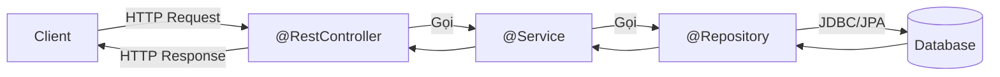

# Chapter 03: Kiến trúc 3 tầng Spring MVC – Controller, Service, Repository

## 1. Kiến trúc 3 tầng


| Tầng | Annotation | Nhiệm vụ |
|------|-----------|---------|
| **Controller** | `@RestController` | Nhận request, validate input, trả response |
| **Service** | `@Service` | Business logic, transaction |
| **Repository** | `@Repository` | Truy cập database |

## 2. @RestController
```java
@RestController
@RequestMapping("/api/v1/users")
public class UserController {
    private final UserService userService;
    public UserController(UserService userService) { this.userService = userService; }

    @GetMapping
    public ResponseEntity<List<UserResponse>> getAllUsers() {
        return ResponseEntity.ok(userService.getAllUsers());
    }

    @GetMapping("/{id}")
    public ResponseEntity<UserResponse> getUserById(@PathVariable Long id) {
        return ResponseEntity.ok(userService.getUserById(id));
    }

    @PostMapping
    public ResponseEntity<UserResponse> createUser(@Valid @RequestBody UserRequest request) {
        return ResponseEntity.status(HttpStatus.CREATED).body(userService.createUser(request));
    }

    @PutMapping("/{id}")
    public ResponseEntity<UserResponse> updateUser(@PathVariable Long id, @Valid @RequestBody UserRequest request) {
        return ResponseEntity.ok(userService.updateUser(id, request));
    }

    @DeleteMapping("/{id}")
    public ResponseEntity<Void> deleteUser(@PathVariable Long id) {
        userService.deleteUser(id);
        return ResponseEntity.noContent().build();
    }
}
```

## 3. Nhận dữ liệu đầu vào
| Annotation | Nguồn | Ví dụ |
|-----------|-------|-------|
| `@PathVariable` | URL path `/users/{id}` | `@PathVariable Long id` |
| `@RequestParam` | Query string `?name=An` | `@RequestParam(required = false) String name` |
| `@RequestBody` | JSON body (POST/PUT) | `@RequestBody UserRequest request` |
| `@RequestHeader` | HTTP header | `@RequestHeader("Authorization") String token` |

## 4. ResponseEntity\<T\>
```java
// Tuỳ biến status code, headers, body
return ResponseEntity.ok(data);                           // 200
return ResponseEntity.status(HttpStatus.CREATED).body(d); // 201
return ResponseEntity.noContent().build();                // 204
return ResponseEntity.notFound().build();                 // 404
return ResponseEntity.badRequest().body(errors);          // 400
```

## 5. Tổ chức Package chuẩn
```
com.example.app/
├── controller/         UserController.java
├── service/            UserService.java (interface)
│   └── impl/           UserServiceImpl.java
├── repository/         UserRepository.java
├── model/entity/       UserEntity.java
├── model/dto/          UserRequest.java, UserResponse.java
├── exception/          ResourceNotFoundException.java, GlobalExceptionHandler.java
└── config/             AppConfig.java
```

## 6. Câu hỏi phỏng vấn & Trả lời chi tiết

### 6.1. Tại sao cần tách 3 tầng Controller - Service - Repository?
Việc phân tầng tuân thủ nguyên lý thiết kế **Separation of Concerns (Phân tách mối quan tâm)** và **Single Responsibility Principle (SRP)**:
1. **Controller (Tầng Giao tiếp HTTP):** Chỉ quan tâm tới việc đón nhận request, bóc tách headers/path/query, validate định dạng sơ bộ, và định dạng lại HTTP Status Code gửi về. Controller **hoàn toàn không được chứa logic tính toán nghiệp vụ hay câu lệnh SQL**.
2. **Service (Tầng Nghiệp vụ cốt lõi - Core Business):** Chứa toàn bộ các quy tắc, công thức tính toán, kiểm tra quyền nâng cao, gọi các API bên thứ 3 và quản lý **Giao dịch cơ sở dữ liệu (`@Transactional`)**.
3. **Repository (Tầng Truy cập Dữ liệu - Data Access):** Chỉ quan tâm tới việc giao tiếp với Database (CRUD, câu lệnh SQL/JPA, tối ưu câu query).
- **Lợi ích to lớn:**
  - **Dễ bảo trì & Mở rộng:** Nếu sau này bạn muốn đổi Database từ MySQL sang MongoDB, bạn chỉ cần viết lại Repository mà Service và Controller vẫn giữ nguyên vẹn 100%. Nếu muốn thêm cổng giao tiếp gRPC hay CLI, bạn chỉ cần tạo thêm Controller mới và tái sử dụng lại Service cũ.
  - **Dễ viết Unit Test:** Dễ dàng kiểm thử Service bằng cách Mock Repository mà không cần bật Web Server.

### 6.2. `@PathVariable` vs `@RequestParam` khi nào dùng cái nào?
- **`@PathVariable` (Tham số đường dẫn):**
  - Trích xuất dữ liệu từ mẫu URL: `/api/v1/users/{id}` $\rightarrow$ `@PathVariable Long id`.
  - **Khi nào dùng:** Khi tham số đó là **thông tin định danh duy nhất và bắt buộc** để xác định tài nguyên cụ thể (User ID, Order ID).
- **`@RequestParam` (Tham số truy vấn Query String):**
  - Trích xuất dữ liệu sau dấu `?`: `/api/v1/users?page=1&size=10&role=ADMIN` $\rightarrow$ `@RequestParam(defaultValue = "0") int page`.
  - **Khi nào dùng:** Khi tham số mang tính **tùy chọn (Optional)**, dùng cho việc **lọc (Filtering), tìm kiếm (Searching), sắp xếp (Sorting), hoặc phân trang (Paging)**. Có thể thiết lập giá trị mặc định bằng `defaultValue = "..."`.

### 6.3. `ResponseEntity<T>` có lợi ích gì so với việc trả trực tiếp Object?
Khi viết `@GetMapping("/users/{id}")`:
- **Nếu trả trực tiếp Object:** `public UserResponse getUser(...)`
  - Bạn **bị trói buộc vào mã HTTP 200 OK**.
  - Không thể chủ động tùy biến HTTP Status Code (ví dụ: trả về `201 Created` khi tạo mới, `204 No Content` khi xóa, `404 Not Found` khi không tìm thấy).
  - Không thể tự thêm các HTTP Headers đặc thù (như `Location`, `Cache-Control`, `Set-Cookie`).
- **Khi dùng `ResponseEntity<T>`:**
  - Là một đối tượng bọc toàn diện đại diện cho toàn bộ HTTP Response của Spring:
    ```java
    return ResponseEntity.status(HttpStatus.CREATED)
            .header("Custom-Header", "Value")
            .body(savedUserDto);
    ```
  - Cung cấp cú pháp Fluent API cực kỳ linh hoạt (`ResponseEntity.ok()`, `ResponseEntity.noContent()`, `ResponseEntity.notFound()`).
  - Giúp API tuân thủ 100% chuẩn thiết kế RESTful chuyên nghiệp.

---
*Thực hành:* Tạo cấu trúc package chuẩn cho thực thể `Product`, viết `ProductController` trả về `ResponseEntity` với các mã 200, 201, 204.
