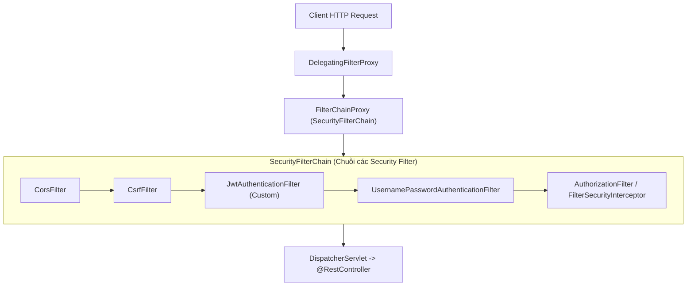
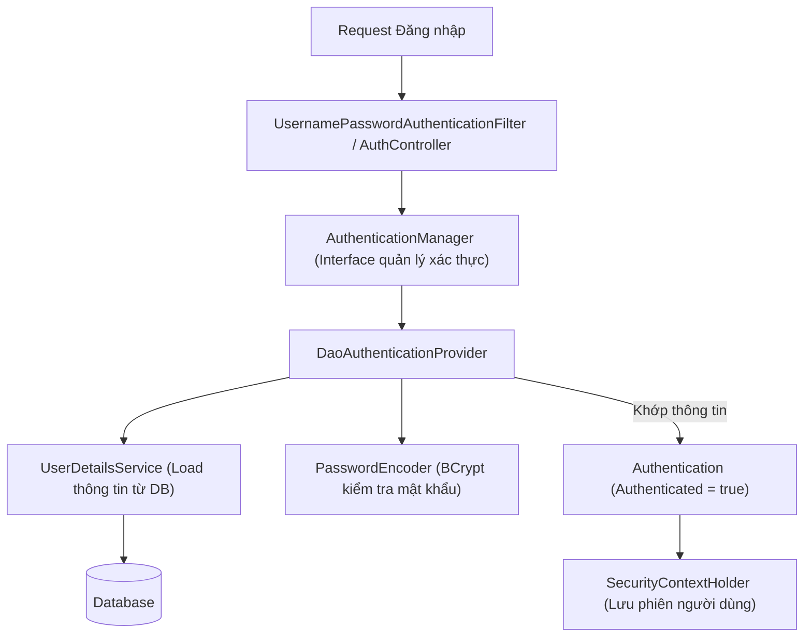

# Chapter 02: Kiến Trúc Spring Security – SecurityFilterChain, AuthenticationManager & UserDetailsService

---

## 1. Bản chất của Spring Security trong Web Application

Trong ứng dụng Spring Boot Web, mọi HTTP Request gửi tới server **không đi thẳng vào Controller ngay**.
Thay vào đó, nó phải đi qua một chuỗi các bộ lọc an ninh gọi là **Servlet Filter Chain**, trong đó Spring Security cắm vào một mắt xích tối quan trọng: **`DelegatingFilterProxy`** và **`FilterChainProxy`**.



---

## 2. Kiến trúc Xác thực (Authentication Architecture)

Khi một user gửi yêu cầu đăng nhập (username + password), hệ thống Spring Security điều phối các thành phần theo mô hình sau:



### Các thành phần cốt lõi:

1. **`SecurityContextHolder` & `SecurityContext`**:
   - Nơi lưu trữ thông tin của người dùng đang thực hiện request hiện tại (`Authentication` object).
   - Được gắn vào `ThreadLocal` của mỗi request thread.
   - Để lấy thông tin user hiện tại ở bất kỳ đâu trong code:
     ```java
     Authentication auth = SecurityContextHolder.getContext().getAuthentication();
     String currentUsername = auth.getName();
     ```

2. **`AuthenticationManager`**:
   - Nhận vào một đối tượng `Authentication` chưa xác thực (chứa username, raw password) và trả về đối tượng `Authentication` đã xác thực (kèm roles, permissions).

3. **`DaoAuthenticationProvider`**:
   - Triển khai chuẩn của `AuthenticationProvider`, chịu trách nhiệm:
     - Gọi `UserDetailsService` để tìm user theo username từ DB.
     - Dùng `PasswordEncoder` để so khớp mật khẩu raw với mật khẩu đã băm.

4. **`UserDetailsService` & `UserDetails`**:
   - **`UserDetails`**: Interface đại diện cho hồ sơ user của Spring Security (gồm username, password, authorities, trạng thái khóa tài khoản).
   - **`UserDetailsService`**: Interface chỉ có **duy nhất 1 phương thức**:
     ```java
     UserDetails loadUserByUsername(String username) throws UsernameNotFoundException;
     ```

---

## 3. Triển khai code thực tế (Spring Boot 3.x)

### Bước 1: Tạo Entity hoặc Adaptor triển khai `UserDetails`
```java
package com.example.app.security;

import com.example.app.entity.UserEntity;
import lombok.RequiredArgsConstructor;
import org.springframework.security.core.GrantedAuthority;
import org.springframework.security.core.authority.SimpleGrantedAuthority;
import org.springframework.security.core.userdetails.UserDetails;

import java.util.Collection;
import java.util.List;

@RequiredArgsConstructor
public class CustomUserDetails implements UserDetails {

    private final UserEntity user;

    @Override
    public Collection<? extends GrantedAuthority> getAuthorities() {
        // Spring Security quy ước Role bắt đầu bằng tiền tố "ROLE_"
        return List.of(new SimpleGrantedAuthority("ROLE_" + user.getRole().name()));
    }

    @Override
    public String getPassword() {
        return user.getPassword();
    }

    @Override
    public String getUsername() {
        return user.getEmail(); // Dùng email làm tên đăng nhập
    }

    @Override
    public boolean isAccountNonExpired() { return true; }

    @Override
    public boolean isAccountNonLocked() { return true; }

    @Override
    public boolean isCredentialsNonExpired() { return true; }

    @Override
    public boolean isEnabled() { return user.isActive(); }
}
```

### Bước 2: Triển khai `UserDetailsService`
```java
package com.example.app.security;

import com.example.app.repository.UserRepository;
import lombok.RequiredArgsConstructor;
import org.springframework.security.core.userdetails.UserDetails;
import org.springframework.security.core.userdetails.UserDetailsService;
import org.springframework.security.core.userdetails.UsernameNotFoundException;
import org.springframework.stereotype.Service;

@Service
@RequiredArgsConstructor
public class CustomUserDetailsService implements UserDetailsService {

    private final UserRepository userRepository;

    @Override
    public UserDetails loadUserByUsername(String email) throws UsernameNotFoundException {
        return userRepository.findByEmail(email)
                .map(CustomUserDetails::new)
                .orElseThrow(() -> new UsernameNotFoundException("Không tìm thấy người dùng với email: " + email));
    }
}
```

### Bước 3: Cấu hình `SecurityFilterChain` trong Spring Boot 3.x
Từ Spring Security 6.x (Spring Boot 3.x), không còn dùng `WebSecurityConfigurerAdapter` mà sử dụng `SecurityFilterChain` Bean với Lambda DSL:

```java
package com.example.app.config;

import com.example.app.security.CustomUserDetailsService;
import lombok.RequiredArgsConstructor;
import org.springframework.context.annotation.Bean;
import org.springframework.context.annotation.Configuration;
import org.springframework.security.authentication.AuthenticationManager;
import org.springframework.security.authentication.AuthenticationProvider;
import org.springframework.security.authentication.dao.DaoAuthenticationProvider;
import org.springframework.security.config.annotation.authentication.configuration.AuthenticationConfiguration;
import org.springframework.security.config.annotation.method.configuration.EnableMethodSecurity;
import org.springframework.security.config.annotation.web.builders.HttpSecurity;
import org.springframework.security.config.annotation.web.configuration.EnableWebSecurity;
import org.springframework.security.config.http.SessionCreationPolicy;
import org.springframework.security.crypto.password.PasswordEncoder;
import org.springframework.security.web.SecurityFilterChain;

@Configuration
@EnableWebSecurity
@EnableMethodSecurity // Cho phép dùng @PreAuthorize ở tầng Controller/Service
@RequiredArgsConstructor
public class SecurityConfig {

    private final CustomUserDetailsService userDetailsService;
    private final PasswordEncoder passwordEncoder;

    @Bean
    public SecurityFilterChain securityFilterChain(HttpSecurity http) throws Exception {
        http
            // 1. Tắt CSRF vì REST API dùng JWT không trạng thái
            .csrf(csrf -> csrf.disable())

            // 2. Phân quyền Endpoint
            .authorizeHttpRequests(auth -> auth
                // Cho phép tự do truy cập các endpoint công khai
                .requestMatchers("/api/v1/auth/**", "/swagger-ui/**", "/v3/api-docs/**").permitAll()
                // Chỉ role ADMIN mới vào được /api/v1/admin/**
                .requestMatchers("/api/v1/admin/**").hasRole("ADMIN")
                // Tất cả các request còn lại bắt buộc phải đăng nhập
                .anyRequest().authenticated()
            )

            // 3. Cấu hình Session Stateless (Không lưu session trên server memory)
            .sessionManagement(session -> session
                .sessionCreationPolicy(SessionCreationPolicy.STATELESS)
            )

            // 4. Khai báo Authentication Provider
            .authenticationProvider(authenticationProvider());

        return http.build();
    }

    @Bean
    public AuthenticationProvider authenticationProvider() {
        DaoAuthenticationProvider authProvider = new DaoAuthenticationProvider();
        authProvider.setUserDetailsService(userDetailsService);
        authProvider.setPasswordEncoder(passwordEncoder);
        return authProvider;
    }

    @Bean
    public AuthenticationManager authenticationManager(AuthenticationConfiguration config) throws Exception {
        return config.getAuthenticationManager();
    }
}
```

---

## 4. Tóm tắt các điểm then chốt

1. Mọi request đều đi qua `SecurityFilterChain`.
2. Trong ứng dụng REST API Stateless, ta cấu hình `SessionCreationPolicy.STATELESS` và vô hiệu hóa CSRF.
3. `UserDetailsService` là cầu nối giữa Database của ứng dụng với cơ chế xác thực của Spring Security.
4. Thông tin định danh của request hiện tại luôn nằm trong `SecurityContextHolder`.
