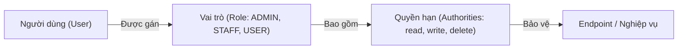

# Chapter 04: Phân Quyền Theo Vai Trò (RBAC) & Method Security (@PreAuthorize)

---

## 1. Khái niệm RBAC (Role-Based Access Control)

**RBAC** là mô hình quản lý quyền truy cập hệ thống dựa trên vai trò (Role) của người dùng. Thay vì cấp quyền trực tiếp cho từng cá nhân, quyền hạn (Permission/Privilege) được gán vào Vai trò, và Người dùng được gán một hoặc nhiều vai trò.



---

## 2. Phân biệt Role và Authority trong Spring Security

Spring Security quản lý mọi đặc quyền thông qua interface **`GrantedAuthority`**:

| Thuộc tính | Role (Vai trò) | Authority / Privilege (Quyền chi tiết) |
| :--- | :--- | :--- |
| **Bản chất** | Một tập hợp nhóm nhiều quyền hạn cấp cao. | Quyền thao tác cụ thể trên một đối tượng/tài nguyên. |
| **Quy ước tên gọi**| Bắt buộc có tiền tố **`ROLE_`** khi lưu trong `GrantedAuthority` (ví dụ: `ROLE_ADMIN`, `ROLE_CUSTOMER`). | Tùy biến tự do (ví dụ: `product:read`, `order:delete`, `user:create`). |
| **Cách dùng với HttpSecurity** | `.hasRole("ADMIN")` *(tự động nối prefix `ROLE_`)* | `.hasAuthority("ROLE_ADMIN")` hoặc `.hasAuthority("product:read")` |
| **Cách dùng với `@PreAuthorize`** | `@PreAuthorize("hasRole('ADMIN')")` | `@PreAuthorize("hasAuthority('product:delete')")` |

---

## 3. Phân quyền cấp độ URL (URL-level Security)

Được cấu hình tập trung trong `SecurityFilterChain`:

```java
@Bean
public SecurityFilterChain securityFilterChain(HttpSecurity http) throws Exception {
    http
        .csrf(csrf -> csrf.disable())
        .authorizeHttpRequests(auth -> auth
            // 1. Công khai không cần đăng nhập
            .requestMatchers("/api/v1/auth/**", "/api/v1/public/**").permitAll()

            // 2. Chỉ có Role ADMIN mới được truy cập các đường dẫn quản trị
            .requestMatchers("/api/v1/admin/**").hasRole("ADMIN")

            // 3. Cho phép cả ADMIN hoặc MANAGER
            .requestMatchers(HttpMethod.DELETE, "/api/v1/products/**").hasAnyRole("ADMIN", "MANAGER")

            // 4. Kiểm tra theo Authority cụ thể
            .requestMatchers(HttpMethod.POST, "/api/v1/orders/**").hasAuthority("order:create")

            // 5. Các request còn lại chỉ cần đăng nhập là được
            .anyRequest().authenticated()
        );
    return http.build();
}
```

---

## 4. Phân quyền cấp độ Phương thức (Method-level Security)

Phân quyền ở tầng URL rất hữu ích, nhưng trong các ứng dụng thực tế phức tạp, **Method-level Security** mạnh mẽ và linh hoạt hơn rất nhiều vì cho phép bảo vệ trực tiếp các hàm trong Controller hoặc Service.

### Bước 1: Kích hoạt trong cấu hình
```java
@Configuration
@EnableWebSecurity
@EnableMethodSecurity // Kích hoạt @PreAuthorize, @PostAuthorize, @Secured
public class SecurityConfig {
    // ...
}
```

### Bước 2: Sử dụng `@PreAuthorize` với biểu thức SpEL (Spring Expression Language)

```java
@RestController
@RequestMapping("/api/v1/users")
@RequiredArgsConstructor
public class UserController {

    private final UserService userService;

    // 1. Chỉ ADMIN được xem danh sách toàn bộ người dùng
    @GetMapping
    @PreAuthorize("hasRole('ADMIN')")
    public ResponseEntity<List<UserResponseDto>> getAllUsers() {
        return ResponseEntity.ok(userService.findAll());
    }

    // 2. Phải có role ADMIN HOẶC MANAGER
    @PutMapping("/{id}/status")
    @PreAuthorize("hasAnyRole('ADMIN', 'MANAGER')")
    public ResponseEntity<Void> updateUserStatus(@PathVariable Long id, @RequestParam boolean active) {
        userService.updateStatus(id, active);
        return ResponseEntity.noContent().build();
    }

    // 3. Quyền sở hữu dữ liệu (Data Ownership):
    // Người dùng chỉ được sửa thông tin của chính mình, HOẶC nếu là ADMIN thì được sửa bất kỳ ai!
    @PutMapping("/{id}")
    @PreAuthorize("hasRole('ADMIN') or #email == authentication.name")
    public ResponseEntity<UserResponseDto> updateProfile(
            @PathVariable Long id,
            @RequestParam String email,
            @RequestBody UpdateProfileDto dto
    ) {
        return ResponseEntity.ok(userService.update(id, dto));
    }
}
```

---

## 5. Xử lý phản hồi lỗi 403 Forbidden chuẩn mực

Khi một người dùng đã đăng nhập (đã có Token hợp lệ) nhưng không đủ quyền truy cập tài nguyên, Spring Security sẽ ném ra `AccessDeniedException`.

Ta cần tạo một custom `AccessDeniedHandler` để trả về JSON format đồng nhất:

```java
@Component
public class CustomAccessDeniedHandler implements AccessDeniedHandler {

    @Override
    public void handle(
            HttpServletRequest request,
            HttpServletResponse response,
            AccessDeniedException accessDeniedException
    ) throws IOException {
        response.setContentType(MediaType.APPLICATION_JSON_VALUE);
        response.setStatus(HttpServletResponse.SC_FORBIDDEN); // 403

        Map<String, Object> body = new HashMap<>();
        body.put("status", 403);
        body.put("error", "Forbidden");
        body.put("message", "Bạn không có quyền thực hiện hành động này!");
        body.put("path", request.getRequestURI());

        new ObjectMapper().writeValue(response.getOutputStream(), body);
    }
}
```

Đăng ký vào `SecurityFilterChain`:
```java
http.exceptionHandling(ex -> ex
    .accessDeniedHandler(customAccessDeniedHandler)
);
```
