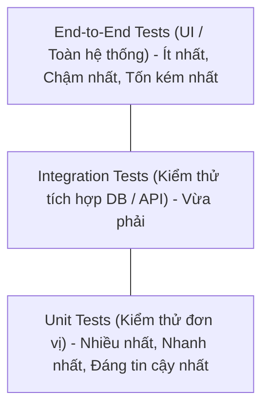

# Chapter 01: Unit Testing với JUnit 5 & Assertions

---

## 1. Unit Testing là gì?

**Unit Test (Kiểm thử đơn vị)** là việc kiểm tra các thành phần nhỏ nhất có thể kiểm thử được của phần mềm (thường là một method hoặc một class) một cách độc lập và cô lập.

### Kim tự tháp kiểm thử (Testing Pyramid):


---

## 2. Mô hình AAA (Arrange - Act - Assert)

Mỗi test case chuẩn mực nên được cấu trúc rõ ràng theo 3 bước:
1. **Arrange (Chuẩn bị)**: Khởi tạo dữ liệu đầu vào, đối tượng và điều kiện tiên quyết.
2. **Act (Hành động)**: Gọi hàm/phương thức cần kiểm thử với dữ liệu đã chuẩn bị.
3. **Assert (Kiểm chứng)**: So sánh kết quả trả về thực tế với kết quả mong đợi.

---

## 3. Các Annotation cốt lõi trong JUnit 5 (Jupiter)

| Annotation | Ý nghĩa |
| :--- | :--- |
| `@Test` | Đánh dấu phương thức là một test case có thể thực thi. |
| `@DisplayName("Mô tả")` | Đặt tên hiển thị trực quan, dễ hiểu trên giao diện chạy test. |
| `@BeforeEach` | Chạy **trước mỗi** `@Test` method (dùng để reset dữ liệu/khởi tạo đối tượng). |
| `@AfterEach` | Chạy **sau mỗi** `@Test` method (dọn dẹp tài nguyên). |
| `@BeforeAll` | Chạy **duy nhất 1 lần trước tất cả** các test methods (phải là `static`). |
| `@AfterAll` | Chạy **duy nhất 1 lần sau tất cả** các test methods (phải là `static`). |
| `@Disabled` | Bỏ qua test case này khi chạy test tự động. |
| `@ParameterizedTest` | Chạy cùng 1 test case với nhiều bộ dữ liệu đầu vào khác nhau (kết hợp `@ValueSource`, `@CsvSource`). |

---

## 4. Các Assertions thông dụng trong JUnit 5

```java
import static org.junit.jupiter.api.Assertions.*;

import org.junit.jupiter.api.DisplayName;
import org.junit.jupiter.api.Test;

class CalculatorTest {

    private final Calculator calculator = new Calculator();

    @Test
    @DisplayName("Cộng hai số nguyên dương chính xác")
    void testAddPositiveNumbers() {
        // Arrange
        int a = 10;
        int b = 20;

        // Act
        int result = calculator.add(a, b);

        // Assert
        assertEquals(30, result, "10 + 20 phải bằng 30");
        assertTrue(result > 0);
    }

    @Test
    @DisplayName("Chia cho 0 phải ném ra ArithmeticException")
    void testDivideByZeroThrowsException() {
        // Kiểm thử ngoại lệ
        ArithmeticException exception = assertThrows(ArithmeticException.class, () -> {
            calculator.divide(10, 0);
        });

        assertEquals("/ by zero", exception.getMessage());
    }

    @Test
    @DisplayName("Kiểm tra nhiều assertions cùng lúc với assertAll")
    void testMultipleProperties() {
        User user = new User("John", 25);

        // assertAll đảm bảo chạy hết mọi assertion dù có một assertion fail
        assertAll("Kiểm tra thông tin user",
            () -> assertEquals("John", user.getName()),
            () -> assertEquals(25, user.getAge()),
            () -> assertNotNull(user)
        );
    }
}
```

---

## 5. Parameterized Tests (Kiểm thử với nhiều bộ dữ liệu)

Giúp giảm trùng lặp code khi kiểm tra cùng một hàm logic với nhiều case khác nhau:

```java
import org.junit.jupiter.params.ParameterizedTest;
import org.junit.jupiter.params.provider.ValueSource;
import static org.junit.jupiter.api.Assertions.assertTrue;

class StringUtilsTest {

    @ParameterizedTest
    @ValueSource(strings = {"racecar", "radar", "level", "madam"})
    @DisplayName("Kiểm tra các chuỗi đối xứng (Palindrome)")
    void testIsPalindrome(String word) {
        assertTrue(StringUtils.isPalindrome(word));
    }
}
```
