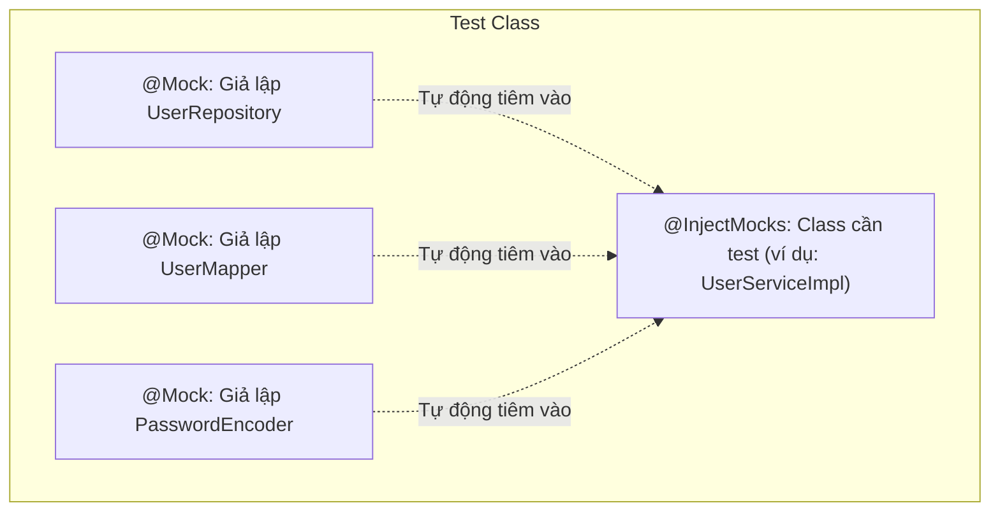

# Chapter 02: Mocking Dependencies Trong Unit Test Với Mockito

---

## 1. Khái niệm Mocking & Tại sao cần Mockito?

Khi viết Unit Test cho tầng **`Service`**, chúng ta chỉ muốn kiểm tra **đúng logic nghiệp vụ của Service đó**.
- Ta **không muốn** kết nối vào Database thật (vì chậm, phụ thuộc dữ liệu có sẵn, làm bẩn DB).
- Ta **không muốn** gọi sang API bên thứ 3 thật (như cổng thanh toán VNPay, gửi SMS, gửi Email).

👉 **Mock** là đối tượng giả lập, bắt chước hành vi của đối tượng thật trong một kịch bản được định nghĩa trước. Thư viện chuẩn mực số 1 trong Java là **Mockito**.

---

## 2. Các Annotation cốt lõi của Mockito



| Annotation | Mục đích |
| :--- | :--- |
| `@ExtendWith(MockitoExtension.class)` | Khai báo ở đầu test class để kích hoạt các annotation của Mockito. |
| `@Mock` | Tạo đối tượng giả lập rỗng (mọi method gọi vào mặc định trả về `null`, `0`, `false`). |
| `@InjectMocks` | Tạo instance thật của class cần kiểm thử, và tự động tiêm các `@Mock` vào constructor của nó. |
| `@Spy` | Bọc lấy một đối tượng thật; giữ nguyên hành vi gốc ngoại trừ các hàm được can thiệp. |

---

## 3. Cú pháp Stubbing & Verification

### A. Định nghĩa hành vi (Stubbing) với `when().thenReturn()`
```java
// Khi repo được gọi với ID = 1L, hãy trả về Optional chứa user mẫu
Mockito.when(userRepository.findById(1L)).thenReturn(Optional.of(mockUser));

// Khi gọi với bất kỳ chuỗi email nào, trả về false
Mockito.when(userRepository.existsByEmail(anyString())).thenReturn(false);

// Giả lập ném ra lỗi khi gọi hàm
Mockito.when(userRepository.save(any())).thenThrow(new RuntimeException("Database error"));
```

### B. Kiểm chứng tương tác (Verification) với `verify()`
```java
// Kiểm tra method findById(1L) có được gọi đúng 1 lần không
Mockito.verify(userRepository, Mockito.times(1)).findById(1L);

// Kiểm tra method save() TUYỆT ĐỐI KHÔNG được gọi
Mockito.verify(userRepository, Mockito.never()).save(any());
```

---

## 4. Viết Unit Test hoàn chỉnh cho tầng Service

```java
package com.example.app.service;

import com.example.app.dto.UserRequestDto;
import com.example.app.dto.UserResponseDto;
import com.example.app.entity.UserEntity;
import com.example.app.exception.ResourceNotFoundException;
import com.example.app.repository.UserRepository;
import com.example.app.service.impl.UserServiceImpl;
import org.junit.jupiter.api.BeforeEach;
import org.junit.jupiter.api.DisplayName;
import org.junit.jupiter.api.Test;
import org.junit.jupiter.api.extension.ExtendWith;
import org.mockito.InjectMocks;
import org.mockito.Mock;
import org.mockito.junit.jupiter.MockitoExtension;
import org.springframework.security.crypto.password.PasswordEncoder;

import java.util.Optional;

import static org.junit.jupiter.api.Assertions.*;
import static org.mockito.ArgumentMatchers.any;
import static org.mockito.Mockito.*;

@ExtendWith(MockitoExtension.class)
class UserServiceImplTest {

    @Mock
    private UserRepository userRepository;

    @Mock
    private PasswordEncoder passwordEncoder;

    @InjectMocks
    private UserServiceImpl userService;

    private UserEntity sampleUser;

    @BeforeEach
    void setUp() {
        sampleUser = UserEntity.builder()
                .id(1L)
                .email("test@example.com")
                .password("encoded_pass")
                .fullName("Nguyễn Văn A")
                .build();
    }

    @Test
    @DisplayName("Lấy User theo ID thành công khi ID tồn tại")
    void getUserById_Success() {
        // Arrange
        when(userRepository.findById(1L)).thenReturn(Optional.of(sampleUser));

        // Act
        UserResponseDto result = userService.getUserById(1L);

        // Assert
        assertNotNull(result);
        assertEquals("test@example.com", result.getEmail());
        assertEquals("Nguyễn Văn A", result.getFullName());
        verify(userRepository, times(1)).findById(1L);
    }

    @Test
    @DisplayName("Lấy User theo ID ném ResourceNotFoundException khi ID không tồn tại")
    void getUserById_NotFound_ThrowsException() {
        // Arrange
        when(userRepository.findById(99L)).thenReturn(Optional.empty());

        // Act & Assert
        assertThrows(ResourceNotFoundException.class, () -> {
            userService.getUserById(99L);
        });

        verify(userRepository, times(1)).findById(99L);
    }

    @Test
    @DisplayName("Tạo mới User thành công khi email chưa tồn tại")
    void createUser_Success() {
        // Arrange
        UserRequestDto request = new UserRequestDto("new@gmail.com", "rawPass", "Trần B");
        when(userRepository.existsByEmail("new@gmail.com")).thenReturn(false);
        when(passwordEncoder.encode("rawPass")).thenReturn("hashedPass");
        when(userRepository.save(any(UserEntity.class))).thenReturn(sampleUser);

        // Act
        UserResponseDto response = userService.createUser(request);

        // Assert
        assertNotNull(response);
        verify(userRepository, times(1)).existsByEmail("new@gmail.com");
        verify(passwordEncoder, times(1)).encode("rawPass");
        verify(userRepository, times(1)).save(any(UserEntity.class));
    }
}
```
