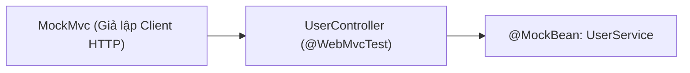

# Chapter 03: Integration Testing Với @SpringBootTest, MockMvc & Testcontainers

---

## 1. Phân biệt Unit Test vs Integration Test

| Tiêu chí | Unit Test (Tầng Service) | Integration Test (Kiểm thử tích hợp) |
| :--- | :--- | :--- |
| **Phạm vi** | 1 hàm duy nhất trong 1 class. | Tương tác giữa nhiều tầng (Controller $\leftrightarrow$ Filter $\leftrightarrow$ Service $\leftrightarrow$ DB). |
| **Spring Context**| **Không load** Spring Context (Chạy siêu nhanh, tính bằng mili-giây). | **Có load** một phần hoặc toàn bộ Spring Context. |
| **Mục đích** | Kiểm tra logic tính toán, rẽ nhánh if/else. | Kiểm tra serialization JSON, routing URL, HTTP status code, validation và transaction. |

---

## 2. Slice Testing cho Tầng Controller với `@WebMvcTest`

Nếu chỉ cần kiểm tra xem Controller có nhận đúng URL, đọc đúng `@PathVariable`, validate đúng `@Valid` và trả về đúng HTTP Status code hay không:
👉 **Không cần load toàn bộ ứng dụng bằng `@SpringBootTest`**. Hãy dùng **`@WebMvcTest`** để chỉ khởi động duy nhất tầng Web (nhanh hơn gấp nhiều lần).



### Triển khai code kiểm thử Controller với MockMvc:
```java
package com.example.app.controller;

import com.example.app.dto.UserRequestDto;
import com.example.app.dto.UserResponseDto;
import com.example.app.service.UserService;
import com.fasterxml.jackson.databind.ObjectMapper;
import org.junit.jupiter.api.DisplayName;
import org.junit.jupiter.api.Test;
import org.mockito.Mockito;
import org.springframework.beans.factory.annotation.Autowired;
import org.springframework.boot.test.autoconfigure.web.servlet.AutoConfigureMockMvc;
import org.springframework.boot.test.autoconfigure.web.servlet.WebMvcTest;
import org.springframework.boot.test.mock.mockito.MockBean;
import org.springframework.http.MediaType;
import org.springframework.test.web.servlet.MockMvc;

import static org.mockito.ArgumentMatchers.any;
import static org.mockito.ArgumentMatchers.eq;
import static org.springframework.test.web.servlet.request.MockMvcRequestBuilders.*;
import static org.springframework.test.web.servlet.result.MockMvcResultMatchers.*;

@WebMvcTest(UserController.class)
@AutoConfigureMockMvc(addFilters = false) // Tạm tắt Spring Security Filters để tập trung test logic Controller
class UserControllerTest {

    @Autowired
    private MockMvc mockMvc;

    @Autowired
    private ObjectMapper objectMapper;

    @MockBean
    private UserService userService;

    @Test
    @DisplayName("GET /api/v1/users/1 trả về 200 OK và đúng dữ liệu JSON")
    void getUserById_ReturnsOk() throws Exception {
        // Arrange
        UserResponseDto mockResponse = new UserResponseDto(1L, "an@gmail.com", "Nguyễn Văn An");
        Mockito.when(userService.getUserById(1L)).thenReturn(mockResponse);

        // Act & Assert
        mockMvc.perform(get("/api/v1/users/1")
                        .accept(MediaType.APPLICATION_JSON))
                .andExpect(status().isOk())
                .andExpect(content().contentType(MediaType.APPLICATION_JSON))
                .andExpect(jsonPath("$.id").value(1))
                .andExpect(jsonPath("$.email").value("an@gmail.com"))
                .andExpect(jsonPath("$.fullName").value("Nguyễn Văn An"));
    }

    @Test
    @DisplayName("POST /api/v1/users với email rỗng phải trả về 400 Bad Request")
    void createUser_InvalidEmail_ReturnsBadRequest() throws Exception {
        // Gửi payload vi phạm @NotBlank hoặc @Email
        UserRequestDto invalidRequest = new UserRequestDto("", "123456", "Nguyễn Văn An");

        mockMvc.perform(post("/api/v1/users")
                        .contentType(MediaType.APPLICATION_JSON)
                        .content(objectMapper.writeValueAsString(invalidRequest)))
                .andExpect(status().isBadRequest());
    }
}
```

---

## 3. Full Integration Test với `@SpringBootTest` & Testcontainers

### A. Vấn đề khi dùng H2 In-Memory Database để test
Nhiều dự án dùng H2 DB để chạy test cho tiện. Tuy nhiên:
- H2 có cú pháp và kiểu dữ liệu khác MySQL/PostgreSQL (ví dụ: JSON column, Full-text search, Stored Procedure).
- Test pass trên H2 nhưng khi deploy lên Production với Postgres/MySQL thì crash!

### B. Giải pháp hiện đại: Testcontainers
**Testcontainers** là thư viện Java cho phép tự động khởi chạy một Docker container chứa Database thật (MySQL, PostgreSQL, Redis, Kafka) ngay khi bắt đầu chạy test, và tự động xóa container khi test hoàn thành.

```java
@SpringBootTest(webEnvironment = SpringBootTest.WebEnvironment.RANDOM_PORT)
@Testcontainers
class FullApplicationIntegrationTest {

    // Tự động kéo Docker image Postgres về và khởi chạy container
    @Container
    static PostgreSQLContainer<?> postgres = new PostgreSQLContainer<>("postgres:15-alpine");

    @DynamicPropertySource
    static void configureProperties(DynamicPropertyRegistry registry) {
        // Gán tự động URL động của container vào cấu hình Spring
        registry.add("spring.datasource.url", postgres::getJdbcUrl);
        registry.add("spring.datasource.username", postgres::getUsername);
        registry.add("spring.datasource.password", postgres::getPassword);
    }

    @Test
    @DisplayName("Toàn bộ ứng dụng khởi động và kết nối DB Postgres thật thành công")
    void contextLoads() {
        assertTrue(postgres.isRunning());
    }
}
```
