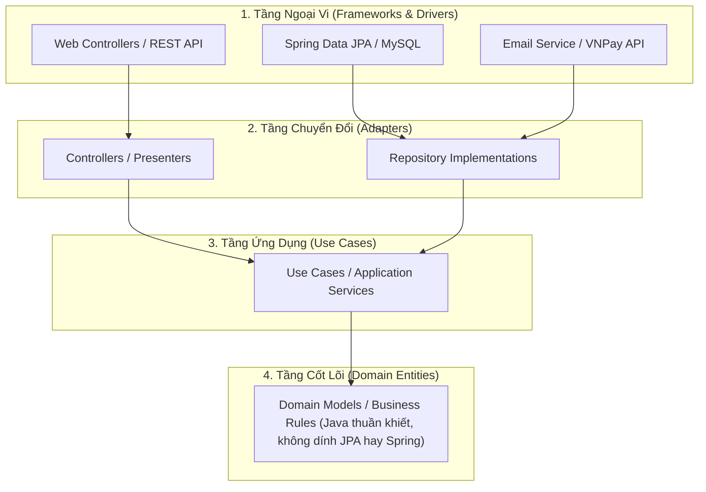

# Chapter 04: Kiến Trúc Clean Architecture & Design Patterns Trong Spring Boot

---

## 1. Từ Layered Architecture đến Clean Architecture

### A. Kiến trúc 3 tầng truyền thống (Layered Architecture)
Mô hình phổ biến nhất: **Controller $\rightarrow$ Service $\rightarrow$ Repository $\rightarrow$ Database**.
- **Điểm yếu**: Tầng nghiệp vụ (Service) thường bị phụ thuộc chặt chẽ vào Database Entity và các thư viện bên ngoài (JPA, Jackson). Khi thay đổi công nghệ DB hoặc nâng cấp framework, mã nguồn nghiệp vụ cốt lõi bị ảnh hưởng theo.

### B. Clean Architecture (Hexagonal / Ports & Adapters)
Nguyên tắc cốt lõi của Clean Architecture: **Quy tắc phụ thuộc (Dependency Rule)**.
> **Các tầng bên ngoài chỉ được phụ thuộc vào các tầng bên trong, tầng bên trong tuyệt đối KHÔNG ĐƯỢC biết gì về tầng bên ngoài!**



---

## 2. Tổ chức cấu trúc thư mục dự án chuẩn (Package by Feature)

Thay vì gom tất cả Controller vào một thư mục, gom tất cả Service vào một thư mục (`Package by Layer`), các dự án lớn ưu tiên tổ chức theo **Tính năng (Package by Feature)** để tăng tính đóng gói:

```text
src/main/java/com/example/app/
├── common/                     <-- Các tiện ích dùng chung (BaseResponse, Exception, Utils)
│   ├── exception/
│   └── response/
├── config/                     <-- Các file cấu hình Spring (@Configuration, Security, Cors)
└── modules/                    <-- Chia theo nghiệp vụ độc lập
    ├── auth/
    │   ├── controller/
    │   ├── dto/
    │   └── service/
    ├── user/
    │   ├── controller/
    │   ├── dto/
    │   ├── entity/
    │   ├── repository/
    │   └── service/
    └── order/
        ├── controller/
        ├── dto/
        ├── entity/
        ├── repository/
        └── service/
```

---

## 3. Các Design Pattern thực tế phổ biến trong Spring Boot

### Pattern 1: Strategy Pattern (Xử lý đa cổng thanh toán)
Tránh dùng chuỗi `if-else` hoặc `switch-case` dài dòng khi cần xử lý nhiều phương thức thanh toán (`VNPAY`, `MOMO`, `ZALOPAY`).

```java
// 1. Khai báo Strategy Interface
public interface PaymentStrategy {
    PaymentType getType();
    PaymentResult process(BigDecimal amount);
}

// 2. Các Concrete Strategies
@Component
public class VnPayStrategy implements PaymentStrategy {
    @Override
    public PaymentType getType() { return PaymentType.VNPAY; }
    @Override
    public PaymentResult process(BigDecimal amount) {
        // Gọi SDK VNPay...
        return new PaymentResult(true, "Thanh toán VNPay thành công");
    }
}

@Component
public class MomoStrategy implements PaymentStrategy {
    @Override
    public PaymentType getType() { return PaymentType.MOMO; }
    @Override
    public PaymentResult process(BigDecimal amount) {
        // Gọi SDK MoMo...
        return new PaymentResult(true, "Thanh toán MoMo thành công");
    }
}

// 3. Strategy Factory / Manager
@Service
public class PaymentContext {

    private final Map<PaymentType, PaymentStrategy> strategies = new EnumMap<>(PaymentType.class);

    // Spring tự động tiêm tất cả các bean implement PaymentStrategy vào danh sách!
    public PaymentContext(List<PaymentStrategy> strategyList) {
        for (PaymentStrategy strategy : strategyList) {
            strategies.put(strategy.getType(), strategy);
        }
    }

    public PaymentResult executePayment(PaymentType type, BigDecimal amount) {
        PaymentStrategy strategy = strategies.get(type);
        if (strategy == null) {
            throw new IllegalArgumentException("Cổng thanh toán không hỗ trợ: " + type);
        }
        return strategy.process(amount);
    }
}
```

---

### Pattern 2: Event-Driven Pattern với `ApplicationEventPublisher`
Tách rời luồng xử lý chính với các tác vụ phụ trợ (như gửi email xác nhận, cộng điểm thưởng):

```java
// 1. Tạo Sự Kiện (Event)
public record OrderPlacedEvent(Long orderId, String customerEmail, BigDecimal totalAmount) {}

// 2. Phát Sự Kiện từ OrderService
@Service
@RequiredArgsConstructor
public class OrderService {
    private final ApplicationEventPublisher eventPublisher;

    @Transactional
    public void createOrder(OrderRequest request) {
        // Lưu đơn hàng vào DB...
        OrderEntity order = orderRepository.save(newOrder);

        // Bắn sự kiện ra hệ thống (OrderService không cần biết ai lắng nghe)
        eventPublisher.publishEvent(new OrderPlacedEvent(order.getId(), order.getCustomerEmail(), order.getTotal()));
    }
}

// 3. Người Lắng Nghe Sự Kiện (EventListener)
@Component
@Slf4j
public class EmailNotificationListener {

    @EventListener
    @Async // Chạy bất đồng bộ trong background thread, không block luồng tạo đơn hàng!
    public void onOrderPlaced(OrderPlacedEvent event) {
        log.info("Đang gửi email xác nhận đơn hàng #{} tới {}", event.orderId(), event.customerEmail());
        // Gửi email...
    }
}
```
