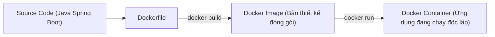

# Chapter 06: Containerization – Đóng Gói Spring Boot & Database Với Docker & Docker Compose

---

## 1. Tại sao cần Docker trong Backend Development?

### Vấn đề kinh điển: "It works on my machine!" (Code chạy trên máy tôi nhưng lỗi trên máy bạn/server)
Sự khác biệt về phiên bản Java, cấu hình hệ điều hành (Windows vs Linux), driver DB hoặc biến môi trường thường gây ra lỗi khi triển khai (Deployment).

### Giải pháp của Docker:
**Docker** đóng gói toàn bộ mã nguồn ứng dụng, môi trường chạy (JRE), các thư viện phụ thuộc và biến cấu hình vào một đơn vị độc lập gọi là **Docker Container**.
- Chạy giống hệt nhau trên máy Mac, Windows, Linux server hay Cloud (AWS, GCP).



---

## 2. Viết `Dockerfile` tối ưu với Multi-Stage Build

Kỹ thuật **Multi-stage build** giúp tách biệt quá trình compile (cần JDK và Maven cồng kềnh) với quá trình runtime (chỉ cần JRE siêu nhẹ), giúp giảm dung lượng image từ ~700MB xuống chỉ còn **~150MB**:

Tạo file `Dockerfile` ngay tại thư mục gốc của project:
```dockerfile
# ==========================================
# GIAI ĐOẠN 1: BUILD JAR VỚI MAVEN & JDK
# ==========================================
FROM eclipse-temurin:17-jdk-alpine AS builder
WORKDIR /build

# Copy file định nghĩa dependency trước để tận dụng Docker Cache
COPY pom.xml .
COPY .mvn .mvn
COPY mvnw .
RUN ./mvnw dependency:go-offline

# Copy toàn bộ mã nguồn và build đóng gói file JAR
COPY src src
RUN ./mvnw clean package -DskipTests

# ==========================================
# GIAI ĐOẠN 2: RUNTIME VỚI JRE SIÊU NHẸ
# ==========================================
FROM eclipse-temurin:17-jre-alpine
WORKDIR /app

# Tạo user bảo mật không quyền root để chạy app
RUN addgroup -S appgroup && adduser -S appuser -G appgroup
USER appuser

# Copy file JAR đã build từ giai đoạn 1 sang
COPY --from=builder /build/target/*.jar app.jar

# Khai báo port của ứng dụng
EXPOSE 8080

# Thiết lập tham số bộ nhớ JVM và khởi chạy ứng dụng
ENTRYPOINT ["java", "-XX:+UseG1GC", "-XX:MaxRAMPercentage=75.0", "-jar", "app.jar"]
```

---

## 3. Các lệnh Docker CLI thiết yếu hàng ngày

| Lệnh | Ý nghĩa |
| :--- | :--- |
| `docker build -t my-backend-app:1.0 .` | Build Docker image từ Dockerfile trong thư mục hiện tại. |
| `docker images` | Liệt kê tất cả các Docker Image đang có trên máy. |
| `docker run -d -p 8080:8080 --name backend-service my-backend-app:1.0` | Khởi chạy container ở chế độ ngầm (`-d`) và map port máy thật 8080 vào container. |
| `docker ps` | Xem danh sách các container đang chạy. |
| `docker logs -f backend-service` | Xem trực tiếp log console của ứng dụng bên trong container. |
| `docker stop backend-service` | Dừng container. |
| `docker rm backend-service` | Xóa container sau khi đã dừng. |

---

## 4. Điều phối toàn bộ hệ thống với `docker-compose.yml`

Thay vì phải chạy thủ công từng lệnh khởi động PostgreSQL, rồi sau đó mới khởi động Spring Boot, **Docker Compose** cho phép khởi chạy toàn bộ kiến trúc chỉ bằng **1 lệnh duy nhất**:

Tạo file `docker-compose.yml` tại thư mục gốc:
```yaml
version: '3.8'

services:
  # Service 1: Cơ sở dữ liệu PostgreSQL
  postgres-db:
    image: postgres:15-alpine
    container_name: shop-postgres
    restart: unless-stopped
    environment:
      POSTGRES_DB: shop_db
      POSTGRES_USER: admin
      POSTGRES_PASSWORD: secretpassword
    ports:
      - "5432:5432"
    volumes:
      - postgres_data:/var/lib/postgresql/data
    networks:
      - shop-network

  # Service 2: Backend Spring Boot
  backend-api:
    build:
      context: .
      dockerfile: Dockerfile
    container_name: shop-backend
    restart: unless-stopped
    ports:
      - "8080:8080"
    depends_on:
      - postgres-db
    environment:
      SPRING_DATASOURCE_URL: jdbc:postgresql://postgres-db:5432/shop_db
      SPRING_DATASOURCE_USERNAME: admin
      SPRING_DATASOURCE_PASSWORD: secretpassword
      SPRING_JPA_HIBERNATE_DDL_AUTO: update
    networks:
      - shop-network

volumes:
  postgres_data:
    driver: local

networks:
  shop-network:
    driver: bridge
```

### Các lệnh vận hành Docker Compose:
- **Khởi động toàn bộ**: `docker compose up -d`
- **Xem log toàn hệ thống**: `docker compose logs -f`
- **Dừng và dọn dẹp**: `docker compose down`
- **Rebuild và chạy lại khi có code mới**: `docker compose up --build -d`
